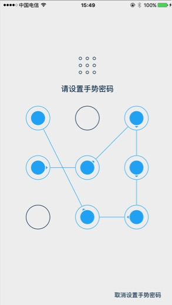
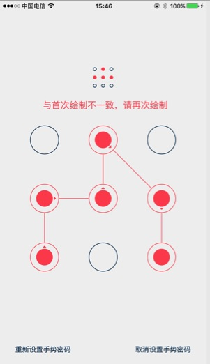

[TOC]

# 1、简介 []()

手势密码插件

## 1.1、说明
封装了设置手势密码,验证手势密码等功能

## 1.2、开源源码
[点击](http://plugin.appcan.cn/details.html?id=539_index)至插件详情页(插件测试用例与插件包已经提供)

## 1.3、插件截图





## 1.4、平台版本支持
本插件的所有API默认支持**Android4.0+**和**iOS7.0+**操作系统.  
有特殊版本要求的API会在文档中额外说明.

## 1.5、接口有效性
本插件所有API默认在插件版本**4.0.0+**可用.  
在后续版本中新添加的接口会在文档中额外说明.

***

#2、 API

##2.1、 方法

### 🍭isGestureCodeSet 检测是否已设置手势密码

`uexGestureUnlock.isGestureCodeSet();`

**说明**

* 检测系统储存中是否存在已设置的手势密码

**参数**

无

**返回值:**

Boolean类型,已设置手势密码时返回true,否则返回false


**示例**

```
var ret = uexGestureUnlock.isGestureCodeSet();
alert(ret);
```

### 🍭resetGestureCode 重置手势密码

`uexGestureUnlock.resetGestureCode();`

**说明**

* 移除系统储存中的手势密码(如果存在)

**参数**

无


**示例**

```
uexGestureUnlock.resetGestureCode();
```

### 🍭config 配置插件

`uexGestureUnlock.config(param);`

**说明**

* 配置插件的相关属性
* 每次调用此接口,均会覆盖之前的配置
* 所有的key均是可选参数,不传时会设置为默认值

**参数**

```
var params = {
    minimumCodeLength:,
    maximumAllowTrialTimes:,
    errorRemainInterval:,
    successRemainInterval:,
    backgroundColor:,
    normalThemeColor:,
    selectedThemeColor:,
    errorThemeColor:,
    creationBeginPrompt:,
    codeLengthErrorPrompt:,
    codeCheckPrompt:,
    checkErrorPrompt:,
    creationSucceedPrompt:,
    verificationBeginPrompt:,
    verificationErrorPrompt:,
    verificationSucceedPrompt:,
    cancelVerificationButtonTitle:,
    cancelCreationButtonTitle:,
    restartCreationButtonTitle:,
    backgroundImage:,
    iconImage:
}
```

各字段含义如下:

| key                           | value 类型 | 说明                   | 默认值              | 备注                                  |
| ----------------------------- | -------- | -------------------- | ---------------- | ----------------------------------- |
| minimumCodeLength             | Number   | 设置密码时的最短长度           | 4                | 至少为1                                |
| maximumAllowTrialTimes        | Number   | 验证密码时的最多尝试次数         | 5                | 设置为0时表示没有上限,                        |
| errorRemainInterval           | Number   | 错误状态的保留时间            | 1000             | 单位毫秒，验证错误时，经过此时间之后才会错误状态提醒会消失       |
| successRemainInterval         | Number   | 操作成功后的保留时间           | 200              | 单位毫秒，操作成功后,经过此时间之后才会关闭插件UI          |
| backgroundColor               | String   | 手势解锁界面的背景色           | "#F1F1F1"        | 支持 3位6位8位的HEXcolor/ RBG / RBGA      |
| normalThemeColor              | String   | 普通状态下的主题颜色           | "#002849"        | 同上                                  |
| selectedThemeColor            | String   | 选中状态下的主题颜色           | "#22B2F6"        | 同上                                  |
| errorThemeColor               | String   | 错误状态下的主题颜色           | "#FE525C"        | 同上                                  |
| creationBeginPrompt           | String   | 设置手势密码前的提示文字         | "请设置手势密码"        |                                     |
| codeLengthErrorPrompt         | String   | 密码长度低于最短长度的错误提示文字    | "请至少连续绘制%d个点"    | %d会被替换成当前的最短密码长度                    |
| codeCheckPrompt               | String   | 确认手势手势密码,要求再次绘制的提示文字 | "请再次绘制手势密码"      |                                     |
| checkErrorPrompt              | String   | 再次绘制的图案不一致的提示文字      | "与首次绘制不一致,请再次绘制" |                                     |
| creationSucceedPrompt         | String   | 设置手势密码成功的提示文字        | "手势密码设置成功"       |                                     |
| verificationBeginPrompt       | String   | 验证手势前的提示文字           | "请验证手势密码"        |                                     |
| verificationErrorPrompt       | String   | 验证手势密码失败的提示文字        | "验证错误!您还可以尝试%d次" | %d会被替换成当前剩余次数                       |
| verificationSucceedPrompt     | String   | 验证手势密码成功的提示文字        | "验证通过"           |                                     |
| cancelVerificationButtonTitle | String   | 取消验证的按钮文字            | "忘记密码?"          |                                     |
| cancelCreationButtonTitle     | String   | 取消设置手势密码的按钮文字        | "取消设置手势密码"       |                                     |
| restartCreationButtonTitle    | String   | 重新设置手势密码的按钮文字        | "重新设置手势密码"       |                                     |
| backgroundImage               | String   | 背景图的文件路径             | 无                | 图片不存在时不会显示,只支持file:// wgt:// res:// |
| iconImage                     | String   | 头像的文件路径              | 无                | 同上                                  |


**示例**

```javascript
var data={
	backgroundImage:"res://bgImage.jpg",
	iconImage:"res://icon.png",
     normalThemeColor:"#F1F1F1",
     selectedThemeColor:"#00ff00",
     errorThemeColor:"#ff0000",
	cancelVerificationButtonTitle:"切换其他账号",
	minimumCodeLength:5
}
uexGestureUnlock.config(data);
```

### 🍭verify 验证手势密码

`uexGestureUnlock.verify(cb);`

**说明**

* 打开插件页面进行验证手势密码操作
* 验证过程中会会有监听[onEventOccur 插件事件发生的监听方法](#onEventOccur 插件事件发生的监听方法)


**参数**

| 参数名称 | 参数类型     | 是否必选 | 说明                 |
| ---- | -------- | ---- | ------------------ |
| cb   | Function | 是    | 验证手势密码结束时,会调用此回调函数 |

**回调参数**

```javascript
var cb = function(error, data){  
}
```

| 参数名称  | 参数类型   | 说明                               |
| ----- | ------ | -------------------------------- |
| error | Number | 是否完成了手势密码验证,0表示验证成功,非0表示验证失败时错误码 |
| data  | String | 验证失败时的错误描述                       |


**示例**

```javascript
uexGestureUnlock.verify(function(error, data){
    if(!error){
        alert("验证成功");
    }else{
        alert("验证失败," + data);
    }
});
```

### 🍭create 设置手势密码

`uexGestureUnlock.create(config,cb);`

**说明**

* 打开插件页面,先验证手势密码,再进行设置手势密码的操作
* 如果当前未设置手势密码,则会跳过验证手势密码的步骤
* 验证过程中会会有监听[onEventOccur 插件事件发生的监听方法](#onEventOccur 插件事件发生的监听方法)


**参数**

| 参数名称   | 参数类型     | 是否必选 | 说明                                       |
| ------ | -------- | ---- | ---------------------------------------- |
| config | String   | 是    | config是JSON字符串,表示设置手势密码的配置信息,如不需要配置,此参数传null |
| cb     | Function | 是    | 设置手势密码结束时,会调用此回调函数                       |


```javascript
var config = {
    isNeedVerifyBeforeCreate:
}
```

各字段含义如下:

| 字段名称                     | 类型      | 是否必选 | 说明                                       |
| ------------------------ | ------- | ---- | ---------------------------------------- |
| isNeedVerifyBeforeCreate | Boolean | 否    | 创建密码之前是否需要验证已经设置的手势密码,默认为true.当为false时,会强制跳过验证手势密码的步骤直接设置新密码 |

**回调参数**

```javascript
var cb = function(error, data){  
}
```

| 参数名称  | 参数类型   | 说明                               |
| ----- | ------ | -------------------------------- |
| error | Number | 是否完成了手势密码设置,0表示设置成功,非0表示设置失败时错误码 |
| data  | String | 设置失败时的错误描述                       |

* error非0时错误码详见[附录-uexGestureUnlockError 错误代码列表](#uexGestureUnlockError 错误代码列表)
* 当且仅当error为0时,会将用户设置的密码存入本地储存
* 应用重启/覆盖升级不影响密码储存,但应用删除会清除掉密码记录


**示例**

```javascript
var data={
	isNeedVerifyBeforeCreate:false
}
uexGestureUnlock.create(data,function(error, data){
    if(!error){
        alert("设置成功");
    }else{
        alert("设置失败," + data);
    }
});
```

### 🍭cancel 终止手势密码验证/设置过程

`uexGestureUnlock.cancel();`

**说明**

* 强制关闭由verify或者create调起的插件界面,终止相应的操作步骤

**参数**

无

**示例**

```
uexGestureUnlock.cancel();

```


##2.2、 监听方法

### 🍭onEventOccur 插件事件发生的监听方法

`uexGestureUnlock.onEventOccur(param);`

**说明**

* 当插件触发相应的事件时,会触发此监听

**参数**

| 参数名称  | 参数类型   | 说明           |
| ----- | ------ | ------------ |
| param | String | json格式,形式见下： |

```javascript
var param={
	eventCode://Number ,必选,插件事件代码
}
```
* eventCode详见[附录-uexGestureUnlockEvent 事件代码列表](#uexGestureUnlockEvent 事件代码列表)

**示例**

```javascript
window.uexOnload=function(type){
	uexGestureUnlock.onEventOccur=function(info){
		alert(info);
	}
}
```

# 3、附录

###uexGestureUnlockError 错误代码列表

| errorCode | 描述                 |
| --------- | ------------------ |
| 1         | 在未设置密码的情况下进行验证密码操作 |
| 2         | 用户取消了创建密码过程        |
| 3         | 用户取消了验证密码过程        |
| 4         | 尝试密码次数过多           |
| 5         | 插件被cancel接口强制关闭    |
| 6         | 发生未知错误             |

###uexGestureUnlockEvent 事件代码列表

| eventCode | 描述             |
| --------- | -------------- |
| 1         | 插件初始化          |
| 2         | 开始手势密码验证       |
| 3         | 手势密码验证失败       |
| 4         | 验证过程被用户取消      |
| 5         | 手势密码验证成功       |
| 6         | 开始手势密码设置       |
| 7         | 用户输入的密码不符合长度要求 |
| 8         | 开始第二次输入手势密码    |
| 9         | 两次输入的密码不一致     |
| 10        | 手势密码设置被用户取消    |
| 11        | 手势密码设置完成       |

# 4、更新历史

### iOS

API版本: `uexGestureUnlock-4.0.0`

最近更新时间:`2015-12-26`

| 历史发布版本 | 更新内容                         |
| ------ | ---------------------------- |

### Android

API版本: `uexGestureUnlock-4.0.0`

最近更新时间:`2015-12-04`

| 历史发布版本 | 更新内容                |
| ------ | ------------------- |
