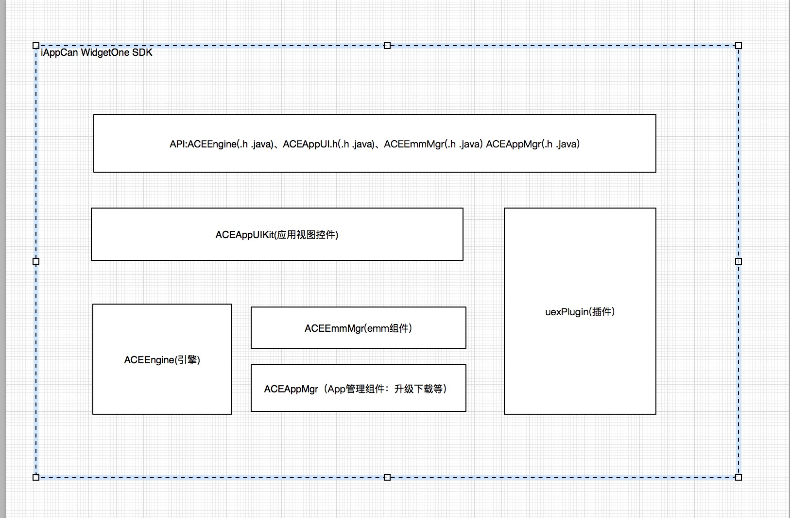
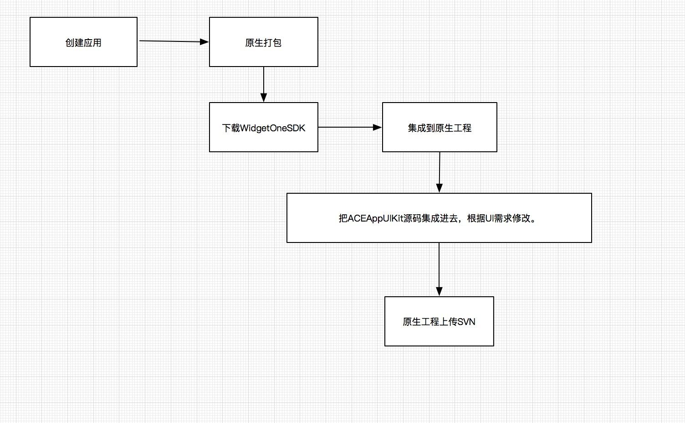

# AppCan WigetOneSDK

## 概述

AppCan WidgetOneSDK是Hybrid应用开发框架，原生开发者可以集成SDK，无须更新App即可实现子应用的管理、升级等功能。

## 架构设计

## 打包流程

## 集成

iOS集成参考：https://github.com/ios-plugin/HelloAppCanNative

Android集成参考：https://github.com/android-plugin/HelloAppCanNative