[TOC]

## 1.概述

* 本文档主要介绍了如何进行AppCan iOS原生插件开发。

### 1.1面向的读者
* 在您阅读此文档时，我们假定您已经具备了基础的iOS应用开发经验，并能够理解相关基础概念。
* 此外,您也应该对HTML,JavaScript,CSS等有一定的了解,并且熟悉在JavaScript和Objective-C环境下的JSON格式数据操作。

### 1.2开发环境需求
* OS X 10.11.5+
* Xcode 8.0+
* AppCan iOS插件开发包([git地址](https://github.com/AppCanOpenSource/appcan-plugin-demo-ios))


## 2.插件开发的准备工作

	以下以开发一个范例插件DemoPlugin为例，为您介绍如何进行iOS插件开发

在本文档中，会用 *斜体字* 表示那些**不是必须，但我们强烈推荐您这样做的操作**。

###2.1 创建静态库工程


* 打开Xcode,在菜单栏中选择 File - New - Project...
* 选择 iOS - Framework & Library - Cocoa Touch Static Library
* 填入您的插件基本信息,*Product Name填`EUExDemoPlugin`(**注1**)*,点击Next
* 选择静态库工程的保存地址，点击create，建立一个静态库工程
* 编辑EUExDemoPlugin这个target的Build Settings如下(**注2**):
  * 将`Product Name`对应的值修改为 `uexDemoPlugin`(**注3**)
  * *将`Per-configuration Build Products Path` 修改为`$SRCROOT/uexDemoPlugin`(**注4**)*

* *编辑EUExDemoPlugin这个target的Build Phases,找到`Copy Files`这个phase,清空其Subpath设置,移除下面列表中的.h文件*

**注1**: 此处静态库工程的命名规则为 `EUEx + 插件名称`，之后出现的`EUExDemoPlugin`亦是如此。

**注2**: 修改target的BuildSettings的方法如下图所示，选中工程主体-选择指定的target-选择BuildSettings-选中all,然后在右上角搜索框中搜索相应的键,双击编辑对应的值

  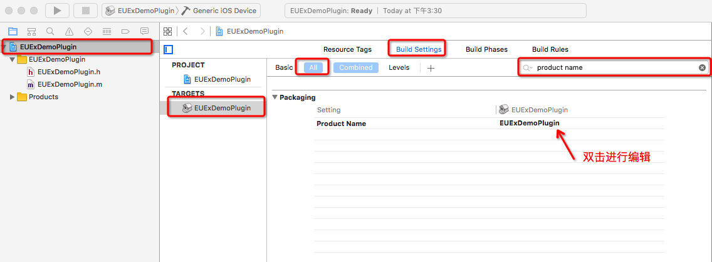 

**注3**: 此处Product Name 的命名规则为 `uex + 插件名称`，之后出现的`uexDemoPlugin`亦是如此。

**注4**: 此设置使得工程编译得到的.a文件会生成在工程目录下的`uexDemoPlugin`文件夹中，方便后续的插件打包

### 2.2 编辑插件调试工程

* 关闭刚刚创建的静态库工程，从AppCan iOS插件开发包中找到`调试插件的工程模板`，复制一份到本地目录
* 打开工程模板中的调试工程AppCanPlugin.xcodeproj,将刚刚创建的静态库工程EUExDemoPlugin.xcodeproj引入此调试工程(直接拖拽即可,注意引入之前要确认静态库工程已经被关闭)
* 编辑主工程AppCanPlugin这个target的Build Phases如下(注1):
  * Target Dependencies 中,添加插件工程的`EUExDemoPluin`的target
  * Link Binary With Libraries中,添加`libeuxDemoPlugin.a`(注2）

**注1**:
编辑Build Phases方法如下图所示:选中工程主体-选择target-选择Build Phases - 展开相应的Phase - 点击下方的按钮进行相应的操作

  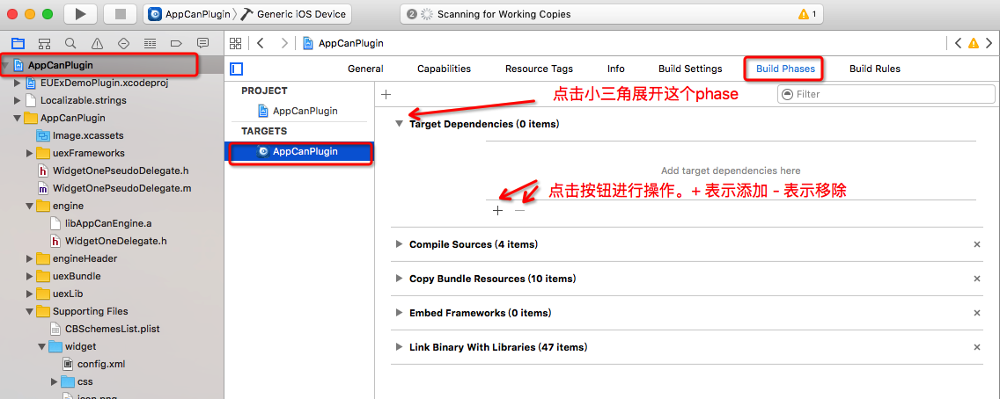


**注2**:
编辑完成后应该如下图所示:

  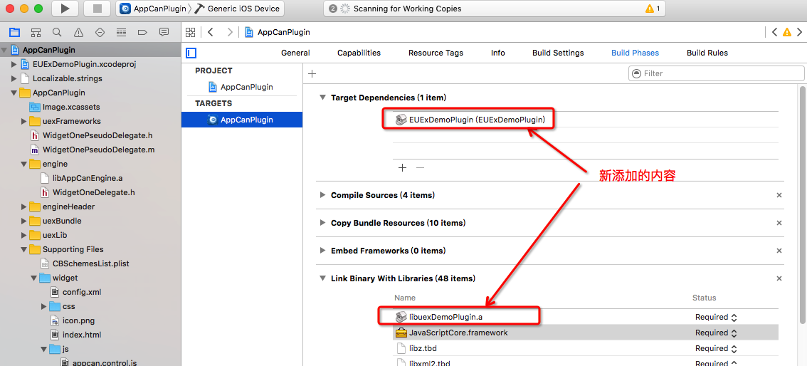 


### 2.3 插件调试工程简介

见下图，红框标注部分都是在插件开发调试中可能会用到的部分。

  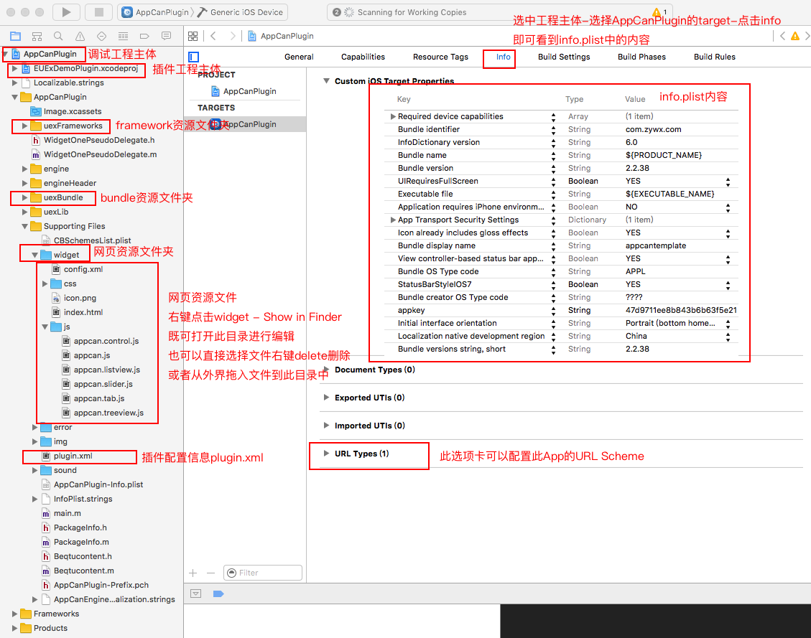  


好了，到此，前期的准备工作就已经完成了，可以正式开始插件开发了!
​	
​	
## 3.开始插件开发

所有的开发和调试工作，都可以直接在刚刚建立的插件调试工程中进行!
​	
### 3.1 编写插件入口类

* 在AppCan插件开发包中,打开`AppCan插件依赖库`文件夹，找到`AppCanKit.framework`，并引入插件工程

* 新建插件入口类EUExPlugin。如果你的插件静态库工程名就是EUExDemoPlugin，那么这个类应该已经自动生成了，此步可跳过。
* 在EUExDemoPlugin这个类的头文件中引入`<AppCanKit/AppCanKit.h>` 并使得EUExDemoPlugin类继承自`EUExBase`
* *在此类中实现生命周期方法`initWithWebViewEngine:`和`clean`*

```objc
- (instancetype)initWithWebViewEngine:(id<AppCanWebViewEngineObject>)engine{
    self = [super initWithWebViewEngine:engine];
    if (self) {
    	//初始化工作
    }
    return self;
}

- (void)clean{
    //NSLog(@"网页即将被销毁");
}
```

#####插件中类的命名规则

* 插件的入口类**必须**命名为`EUEx`开头的类名;
* 插件中其他的类**无命名限制，但建议增加独特的前缀**，以避免和引擎以及其他插件中的类产生类名冲突，导致打包失败

#####`EUExBase`简介

* `EUExBase`是AppCan插件入口的基类，所有的插件入口类都必须继承自此类。
* `EUExBase`拥有1个实例变量和3个实例方法
* 实例变量`webViewEngine`是一个**弱引用**，指向了AppCan的网页引擎。任何对网页的操作都会通过此对象进行。
* 实例方法`initWithWebViewEngine:`是默认的初始化方法。
  * 每当一个网页里调用某插件的方法时(比如uexDemoPlugin.test();),都会先去寻找插件的入口实例(EUExDemoPlugin),如果不存在，则会通过此方法创建一个新的实例并持有它。
  * 对于同一个插件,每个网页里只会有一个插件实例，但不同的网页会拥有不同的插件实例。
  * 插件子类可以覆写此方法进行自定义初始化设置，但必须调用父类的此方法
* 实例方法`clean` 会在网页被关闭前调用
  * 插件子类可以覆写此方法进行必要的清除工作，比如停止NSTimer,关闭网络连接等等。
  * 在此方法被调用后，插件不应该再使用self.webViewEngine对网页进行任何操作。
  * 在此方法被调用后, 除非特殊情况，不要让插件实例被其他任何类强硬用，否则很有可能会造成内存问题。
* 实例方法`absPath:`用于转换AppCan协议路径(`res://`,`wgt://`等)至绝对路径。

### 3.2 插件和网页进行交互

####3.2.1 暴露接口给网页
本小节示范了如何让网页JS去调用一个原生的方法helloWorld，实现 JavaScript --> OC 的操作
​	
* 在EUExDemoPlugin类中实现一个方法`helloWorld:`

```objc
- (void)helloWorld:(NSMutableArray *)inArguments{
    //打印 hello world!
    NSLog(@"hello world!");
}
```
#####插件入口类中实现供网页调用的方法的注意事项

	1.注意所有供网页调用的方法必须带有一个类型为NSMutableArray类型的参数
	2.引擎默认是在主线程异步调用插件方法，因此需要长时间耗时的阻塞操作,最好放在非主线程中进行，以免造成App卡死。

* 在主工程的plugin.xml中添加此接口的信息，规则如下


```xml
<?xml version="1.0" encoding="utf-8" ?>
<uexplugins>
    <plugin name="uexDemoPlugin">
        <method name="helloWorld"></method>
    </plugin>
</uexplugins>
```

***

#####plugin.xml中注册插件方法的基本规则

1.每一个插件唯一对应了一个`<plugin>`节点,节点中必须声明此插件的名字 用`name`字段表示
2.在插件`<plugin>`节点内，每个 `<method>`节点对应了一个暴露给网页的插件方法,方法名字用`name`字段表示

***

* 在网页中写一个按钮,在点击按钮的JS事件中调用`uexDemoPlugin.helloWorld();`

html部分

```html
<input type="button" value="helloWorld" onclick="helloWorld();"/>
```

JavaScript部分

```js
var helloWorld = function(){
    uexDemoPlugin.helloWorld();
}
```

* 好了 让我们运行工程，点击按钮看一下效果吧！

  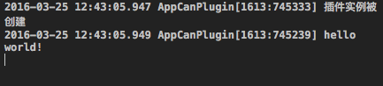 


####3.2.2 网页传值给原生环境

本小节示范了如何从网页传值给原生环境
​	
* 在EUExDemoPlugin类中实现一个方法`sendValue:`

```objc
- (void)sendValue:(NSMutableArray *)inArguments{
    //打印传入的参数个数
    NSLog(@"arguments count : %@",@(inArguments.count));
    //打印每个参数的描述，和参数所在的类的描述
    for (NSInteger i = 0; i < inArguments.count; i++) {
        id obj = inArguments[i];
        NSLog(@"value : %@ , class : %@ ",[obj description],[[obj class] description]);
    }
}
```
* 在plugin.xml中添加方法

```xml
<?xml version="1.0" encoding="utf-8" ?>
<uexplugins>
    <plugin name="uexDemoPlugin">
        <method name="helloWorld"></method>
        <method name="sendValue"></method>
    </plugin>
</uexplugins>
```

* 在网页中调用的JS如下

```js
uexDemoPlugin.sendValue("aaa",12,true,["x","y"],{key:"value"});
```
* 结果如下

   


#####JaveScript-->OC传值的转换规则
由上述例子可以看到,JSValue按照如下规则转换成了NSObject

| JSValue        | NSObject           |
| -------------- | ------------------ |
| String         | NSString           |
| Number         | NSNumber           |
| Boolean        | NSNumber           |
| Array          | NSArray            |
| Object         | NSDictionary       |
| null,undefined | NSNull             |
| Function       | ACJSFunctionRef(注) |

注: 此项转换工作是由AppCan引擎完成；

#### 3.2.3 解析网页传递的数据

* 有时JS传递过来的值可能并不是你所期望的类型,此时直接从参数数组中取值,可能会由于类型错误导致闪退.比如

```objc
NSString *identifier = inArguments[0];
//如果前端传值"1",则代码正常运作
//如果前端传值1,则此段代码会导致unrecognized selector错误
//因为此时identifier是一个NSNumber,并没有length方法
BOOL isIDValid = identidier.length > 0;
```

* 因此建议使用`AppCanKit`中提供的宏`ACArgsUnpack`来解析参数
* 在EUExDemoPlugin类中实现一个方法`sendArguments:`,并在config.xml中添加相应的方法。

```objc
- (void)sendArguments:(NSMutableArray *)inArguments{
  	//ACArgsUnpack的详细用法请参考AppCanKit内的注释
    ACArgsUnpack(NSString *arg1,NSNumber *arg2,NSArray *arg3,NSDictionary *arg4) = inArguments;
    for(id arg in @[arg1,arg2,arg3,arg4]){
        ACLogDebug(@"value : %@ , class : %@ ",[arg description],[[arg class] description]);
    }
}
```

* 在网页中调用的JS如下

```js
uexDemoPlugin.sendArguments(123,"45",JSON.stringify([6,7]),JSON.stringify({key: "value"}))
```
* 结果如下

  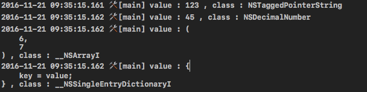  


可以`ACArgsUnpack`宏正确的将参数转换成了需要的类型

#### 3.2.4 原生异步回调JS给网页

```
此小节示范了如何在插件中执行网页中的JS方法,实现OC --> JavaScript 的操作
```

##### 执行网页中的JS脚本进行回调的方法实现

* 在网页的window.uexOnload函数中注册回调函数

  ```js
  //封装一个JS方法用于查看回调结果
  var showDetails = function(){
      var count = arguments.length;
      var result = "";
      for (var i = 0;i < count;i ++){
          var obj = arguments[i];
          result = result + ("参数"+ i + "   类型:" +typeof(obj) + "   值:" + obj + "\n");
      }
      alert(result);
  }
  //注册回调函数必须要在window.uexOnload 或者AppCan.ready(如果你已经引入了appcan.js)中进行
  //插件调试时,建议使用window.uexOnload,避免AppCan JSSDK可能的干扰
  window.uexOnload = function(){
      uexDemoPlugin.cbDoCallback = function(jsonStr){
        //回调的参数是JSON字符串，需要解析成Object
        var json = JSON.parse(jsonStr);
        //查看回调结果
        showDetails(jsonStr,json,json.key);
    }
  };
  ```


* 在EUExDemoPlugin类中实现一个方法`doCallback:`,并在config.xml中添加相应的方法。


```objective-c
- (void)doCallback:(NSMutableArray *)inArguments{
    NSDictionary *dict = @{
                           @"key":@"value"
                           };
  	//ac_JSONFragment 方法，可以将NSDictionary转换成JSON字符串
    [self.webViewEngine callbackWithFunctionKeyPath:@"uexDemoPlugin.cbDoCallback"
                                          arguments:ACArgsPack(dict.ac_JSONFragment)
                                         completion:^(JSValue * _Nullable returnValue) {
                                             if (returnValue) {
                                                 ACLogDebug(@"回调成功!");
                                             }
                                         }];
}
```

* 调用接口后,alert窗口结果如下

  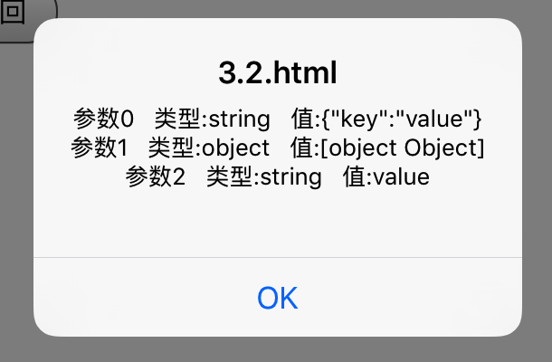 


####3.2.5 同步返回值给网页

	方法可以直接同步返回值给网页。
	注意若使用同步回调，需避免在返回值前执行耗时的操作，以免影响用户体验。

* 在EUExDemoPlugin类中实现一个方法`doSyncCallback:`,并在plugin.xml中声明

```objc
//同步方法的返回值,必须是JSValue对应的NSObject子类
- (NSDictionary *)doSyncCallback:(NSMutableArray *)inArguments{
    return @{
             @"key1":@"value1",
             @"key2":@(NO),
             @"key3":@{
                     @"subKey":@"subValue"
                     }
             };
}
```


* 在网页中如下所示调用JS进行测试

```js
//将获取的返回值赋值给obj
var obj = uexDemoPlugin.doSyncCallback();
//查看obj的结构
showDetails(obj,obj.key1,obj.key2,obj.key3.subKey);
```

* 控制台显示的结果如下

  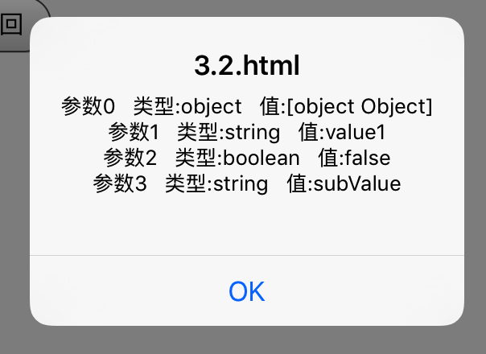  


#####OC-->JavaScript同步返回值的转换规则


| NSObject     | JSValue |
| ------------ | ------- |
| NSString     | String  |
| @ YES,@ NO   | Boolean |
| 其他NSNumber   | Number  |
| NSArray      | Array   |
| NSDictionary | Object  |
| nil,NSNull   | null    |

#### 3.2.6 调用JS中传入的回调函数

```
引擎中提供了对JSFunction的JavaScriptCore封装,方便开发者直接调用由JS传入的回调函数
```

* 在EUExDemoPlugin类中实现一个方法`doFunctionCallback:`,并在config.xml中添加相应的方法

  ```objective-c
  - (void)doFunctionCallback:(NSMutableArray *)inArguments{
    	//当要处理来自JS的回调函数时,直接用ACArgsUnpack宏对参数进行解包
    	//解包类型指定为ACJSFunctionRef
      ACArgsUnpack(ACJSFunctionRef *callback) = inArguments;
    	//ACJSFunctionRef对象会保证JS中的回调函数不被GC回收,直至ACJSFunctionRef对象本身被销毁,或者由于其他原因(比如网页被关闭)导致JS上下文被销毁
    	//执行JS中的回调函数
      [callback executeWithArguments:nil completionHandler:^(JSValue * _Nullable returnValue) {
        	//completionHandler会在JS回调函数执行完之后被调用,returnValue为JS回调函数的返回值
           ACLogDebug(@"回调成功!");
      }];
  }
  ```

* 网页中执行下列JS,可以查看回调结果

  ```js
  uexDemoPlugin.doFunctionCallback(function(){
  	alert("function callback!");
  });
  ```

  ​

### 3.3 插件UI操作

####3.3.1 在网页上添加View

本小节介绍了插件如何在网页上添加原生的View

#####添加view的限制
	原生View总是会在网页顶端,即网页中所有dom元素上方

* 在`EUExDemoPlugin`类中实现方法`addView:` `removeView`并在plugin.xml中声明
  * addView方法有一个必选参数isScrollable 用来控制被添加的view是跟随网页滑动 还是固定在窗口上
  * 当需要跟随网页滑动时,view应添加到引擎的webScrollView对象上,反之,应添加到引擎的webView对象上
  * 用一个实例变量`aView`来管理被添加的View

```objc
@property (nonatomic,strong)UIView *aView;
```

```objc
- (void)addView:(NSMutableArray *)inArguments{
    if (self.aView) {
        //如果已经添加了view 直接返回
        return;
    }
    ACArgsUnpack(NSDictionary *info) = inArguments;
    NSNumber *isScrollableNum = numberArg(info[@"isScrollable"]);
    if (!isScrollableNum) {
        //如果参数信息不包含isScrollable这个键 直接返回
        return;
    }

    BOOL isScroll = [isScrollableNum boolValue];
    //新建一个view，并将其背景设置为红色
    UIView *view = [[UIView alloc]initWithFrame:CGRectMake(10, 400, 300, 200)];
    view.backgroundColor = [UIColor redColor];
    if (isScroll) {
        [[self.webViewEngine webScrollView] addSubview:view];
    }else{
        [[self.webViewEngine webView] addSubview:view];
    }
    //插件对象持有此view,方便对其进行移除操作
    self.aView = view;
}

- (void)removeView:(NSMutableArray *)inArguments{
    if (self.aView) {
        [self.aView removeFromSuperview];
        self.aView = nil;
    }
}
```

* 在网页中我们设置一个单选框用于控制是否跟随网页滑动，相关HTML以及JS代码如下

```html
<div>
	isScrollable
	<input id="checkbox1" type="checkbox" name="isScrollable"/>
</div>
<input type="button" value="addView" onclick="addView();"/><br>
<input type="button" value="removeView" onclick="removeView();"/><br>
<!--还需要添加一些占位文本使得网页超过一屏,从而可以滑动-->
```

```js
var addView = function(){
    //获取单选框的网页对象
    var checkbox1 = document.getElementById("checkbox1");
    //以单选框是否被勾选作为isScrollable的值，是个boolean
    var json = {
        isScrollable:checkbox1.checked
    }
    uexDemoPlugin.addView(JSON.stringify(json));
}
var removeView = function(){
    uexDemoPlugin.removeView();
}
```

* 运行结果如下
   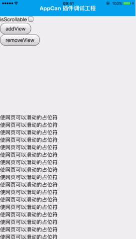  


####3.3.2在网页中展示一个viewController

	本小节介绍了插件如何在网页上展示原生的ViewController。

#####展示viewController的限制

	只能以present的方式从当前的网页controller中切换到你自己的viewController中;

* 在插件工程中新建一个继承自UIViewController的类`uexDemoPluginViewController`,然后在它的view上添加一个按钮，按钮会调用`EUExDemoPlugin`中的`dismissViewController`方法；

uexDemoPluginViewController.h

```objective-c
@class EUExDemoPlugin;
@interface uexDemoPluginViewController : UIViewController
- (instancetype)initWithEUExObj:(EUExDemoPlugin *)euexObj;
@end
```
uexDemoPluginViewController.m

```objective-c
#import "uexDemoPluginViewController.h"
#import "EUExDemoPlugin.h"

@interface uexDemoPluginViewController()
@property (nonatomic,weak)EUExDemoPlugin *euexObj;
@end

@implementation uexDemoPluginViewController


- (instancetype)initWithEUExObj:(EUExDemoPlugin *)euexObj{
    self = [super init];
    if (self) {
        _euexObj = euexObj;
    }
    return self;
}

- (void)viewWillAppear:(BOOL)animated{
    [super viewWillAppear:animated];
    self.view.backgroundColor = [UIColor whiteColor];
    
    UIButton *button = [UIButton buttonWithType:UIButtonTypeSystem];
    button.frame = CGRectMake(100, 100, 180, 60);
    [button setTitle:@"关闭ViewController" forState:UIControlStateNormal];
    [button addTarget:self action:@selector(onCloseButtonClick:) forControlEvents:UIControlEventTouchUpInside];
    [self.view addSubview:button];
    
}
- (void)onCloseButtonClick:(id)sender{
    [self.euexObj dismissViewController];
}
```

* `EUExDemoPlugin`类中实现方法`presentController`并在plugin.xml中声明

```objective-c
@property (nonatomic,strong)uexDemoPluginViewController *aViewController;
```

```objective-c
- (void)presentController:(NSMutableArray *)inArguments{
    if (self.aViewController) {
        return;
    }
    uexDemoPluginViewController *controller = [[uexDemoPluginViewController alloc]initWithEUExObj:self];
    [[self.webViewEngine viewController]presentViewController:controller animated:YES completion:nil];
    self.aViewController = controller;
}
```
* `EUExDemoPlugin`类中实现方法`dismissViewController` 关闭被present的ViewController,并给前端一个监听回调onControllerClose

```objective-c
- (void)dismissViewController{
    if (self.aViewController) {
        [self.aViewController dismissViewControllerAnimated:YES completion:^{
            [self callbackJSONWithName:@"onControllerClose" object:nil];
            self.aViewController = nil;
        }];
    }
}
```
* 前端JS中封装相关的回调方法,然后执行`uexDemoPlugin.presentController();`

```js
//在window.uexOnload中
uexDemoPlugin.onControllerClose = function(){
 	alert("controller 被关闭!")
}
```

* 结果如下
  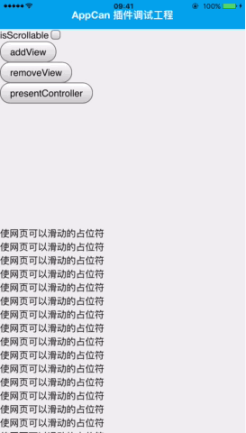 


##4.生成插件包

	此步骤应该在您插件所有接口封装完毕，并在调试工程中测试完成后再进行
	以下说明中均以范例插件uexDemoPlugin为例进行的操作。
	在实际操作时,应该将所有出现的DemoPlugin替换成您自己的插件名字。


###4.1 编译插件静态库.a文件


* 确认插件调试工程已经关闭,然后打开静态库工程EUExDemoPlugin.xcodeproj
* 左上角的schemes管理中，选择**`EUExDemoPlugin` - `Generic iOS Device`**
* 点击Product-Build,生成插件的.a文件`libuexDemoPlugin.a`

###4.2 编辑plugin.xml

* plugin.xml主要记录了插件的接口信息
* 此plugin.xml和插件调试工程中的plugin.xml完全一样，您可以直接拷贝过来
  * 如果您的调试工程在同时调试多个插件,那么在拷贝完成之后应删去`<uexplugins>`节点中其他插件的信息
* 或者以下列文本为基础,在`<uexplugins>`节点中按照[plugin.xml中注册插件方法的基本规则](#plugin.xml中注册插件方法的基本规则)完成plugin.xml的编辑

plugin.xml空白模板,是一个标准的xml文件
```xml
<?xml version="1.0" encoding="utf-8" ?>
<uexplugins>
</uexplugins>
```

最终完成的plugin.xml示例如下

```xml
<?xml version="1.0" encoding="utf-8" ?>
<uexplugins>
    <plugin name="uexDemoPlugin">
        <method name="helloWorld"></method>
        <method name="sendValue"></method>
        <method name="sendJSONValue"></method>
        <method name="doCallback"></method>
        <method name="doSyncCallback"></method>
        <method name="addView"></method>
        <method name="removeView"></method>
        <method name="presentController"></method>
    </plugin>
</uexplugins>
```


###4.3编辑info.xml

* info.xml主要记录了插件的版本信息
* 示例模板如下

```xml
<?xml version="1.0" encoding="utf-8" ?>
<uexplugins>
    <plugin
        uexName="name" version="4.0.x" build="x">
    </plugin>
</uexplugins>
```
其中 name 替换成uex开头的插件名  x替换成当前插件的版本号(非负整数)

* 然后向plugin节点中加入各个版本的简介,这些简介以倒序加入,由一个`<info>`节点和多个(可以为0个)`<build>`节点构成。
  * `<info>`节点记录了当前版本的简介
  * `<build>`节点记录了历史版本的简介
  * **当插件版本更新时，应该将当前的`<info>`节点改为`<build>`节点，同时在其之前添加新的`<info>`节点**
* 最终完成的info.xml范例如下

```xml
<?xml version="1.0" encoding="utf-8" ?>
<uexplugins>
    <plugin
        uexName="uexDemoPlugin" version="4.0.1" build="1">
        <info>1:添加其他开发说明的示例代码</info>
        <build>0:AppCan iOS插件范例</build>
    </plugin>
</uexplugins>
```


###4.4 获得插件包

* 新建名为`uexDemoPlugin`的文件夹并进入。如果您进行了前文中提及所有的可选操作,那么在插件工程目录下面,应该自动生成了此文件夹,可以直接使用。
* 将`libuexDemoPlugin.a`,`plugin.xml`,`info.xml`拷贝至此文件夹中。如果您进行了前文中提及所有的可选操作,那么编译工程出来的.a文件将自动在此目录中生成。
* 根据具体情况,将可能存在的以下文件拷贝至此文件夹中,具体请看[5.其他开发说明](#5.其他开发说明)中的说明
  * 第三方库依赖的`.bundle`文件
  * 第三方库的静态`.framework`文件
  * 插件资源包`uexDemoPlugin.bundle`
  * 插件配置文件`uexDemoPlugin.plist`
* 全部拷贝工作完成后，`uexDemoPlugin`文件夹内的内容如下图所示
  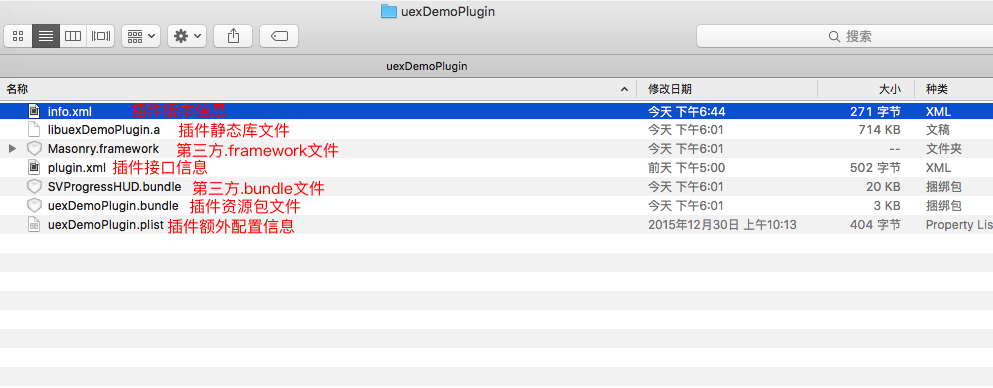


* 以上所有步骤均完成后，返回上级目录,压缩`uexDemoPlugin`文件夹,得到插件zip包。
* 此zip包可以直接上传作为自定义插件包使用。

##5.其他开发说明

	以下是一些您在开发过程中可能需要的说明。
	所有说明均可在范例工程中找到相应的示例代码。

###5.1 插件如何引入第三方库

插件引入第三方库的具体规则如下

* 第三方Library(.a文件),直接引入插件工程参与编译即可。
* 资源捆绑包(.bundle)和第三方静态framework(.framework),需要引入插件工程参与编译,生成插件包时也需要单独放入压缩包中,和插件.a处于同一目录下。
  * 调试时，.bundle和.framework需要在调试工程中再引入一遍，否则会无法找到相应的文件。
  * *建议插件工程将引入的.bundle和.framework文件添加到`Copy Files`的Build Phase中,这样可以在编译时将这些文件直接复制至`uexDemoPlugin`文件夹中*
* 动态framework,目前暂不支持。

###5.2 插件如何引用资源文件

	本小节主要介绍了如何建立插件自己的资源捆绑包(.bundle文件)以供使用。
	这里的资源文件包括但不限于xib,storyboard,png,jpg,json,xml,js,plist等文件


####5.2.1 生成插件资源捆绑包的target

* 选中插件静态库工程，然后点击菜单栏中的File - New - Target.. ,在弹出的对话框中选择OS X - Framework & Library - Bundle
  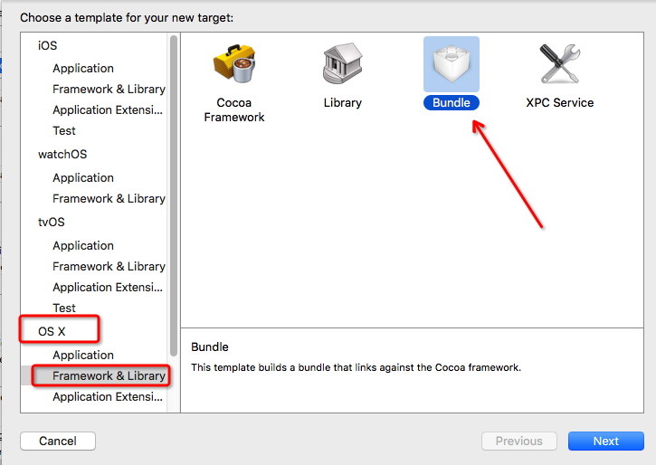

* *product Name取名为uexDemoPluginBundle*,点击finish完成创建。
* 修改此target的如下Build Settings
  * 将`Product Name`对应的值修改为 `uexDemoPlugin`
  * *将`Pre-configuration Build Products Path` 修改为`$SRCROOT/uexDemoPlugin`(注1)*
  * 将`Code Signing Identity` 修改为`Don't Code Sign`
  * 将`Combine High Resolution Artwork`修改为`No`(注2)
  * 将`Info.plist File`的值置为空
* 在工程的uexDemoPluginBundle群组下,找到info.plist这个文件，右键选择`delete`，然后选择`Move to Trash`以删除该文件
* 为静态库target添加此bundle的target的依赖(注3)
  * 修改`EUExDemoPlugin`这个target的Build Phases ，在`Target Dependicies`中添加刚刚创建的bundle的target


注1:此settings是为了让build时将此bundle直接生成在`uexDemoPlugin`文件夹中

注2:如果你的资源包中不包含图片文件,那么此设置可跳过。

注3:这个设置是为了保证在插件clean时可以清除生成的bundle文件,在插件build时会自动生成新的bundle文件

* 接下来,可以把插件需要的资源文件全部添加至`uexDemoPluginBundle`这个target中即可

####5.2.2 如何引用插件bundle中的资源文件

* AppCanKit提供了对NSBundle的扩展`ac_bundleForPlugin:`方法,用以获取插件对应的NSBunble实例

**bundle加载@ 2x ,@ 3x图片文件的处理方法**

获取到NSBundle实例后,用NSBundle的`pathForResource: ofType:`并不能自动识别@ 2x,@ 3x的图片文件,最好用`resourcePath`方法获得实际路径，然后拼接得到图片路径。
示例如下

```objective-c
NSBundle *pluginBundle = [NSBundle ac_bundleForPlugin:@"uexDemoPlugin"];
//从bundle中读取资源图片文件的示例
//直接用[pluginBundle pathForResource:@"sun" ofType:@"png"];只能匹配"sun.png"这个文件的路径，找不到会返回nil,而不会寻找文件"sun@2x.png"和"sun@3x.png".
NSString *path = [[pluginBundle resourcePath] stringByAppendingPathComponent:@"sun.png"];
UIImage *image = [UIImage imageWithContentsOfFile:path];
```

####5.2.3 插件如何进行读取国际化文件Localizable.strings

* 将国际化文件Localizable.strings放入插件bundle中，然后用AppCanKit中的方法`ac_plugin: localizedString:`得到国际化的字符串.示例如下

```objc
label.text = [NSString  ac_plugin:@"uexDemoPlugin" localizedString:@"title"];
```

###5.3 插件如何获取系统事件

####5.3.1 ApplicationDelegate事件

AppCan会将大部分ApplicationDelegate事件分发到每个插件入口类，插件入口类用相应的**类方法**接收即可
目前插件入口类可供接收的类方法有

```objective-c
+ (BOOL)application:(UIApplication *)application didFinishLaunchingWithOptions:(NSDictionary *)launchOptions;
+ (void)application:(UIApplication *)app didRegisterForRemoteNotificationsWithDeviceToken:(NSData *)deviceToken;
+ (void)application:(UIApplication *)app didFailToRegisterForRemoteNotificationsWithError:(NSError *)err;
+ (void)application:(UIApplication *)application didReceiveRemoteNotification:(NSDictionary *)userInfo;
+ (void)application:(UIApplication *)application didReceiveRemoteNotification:(NSDictionary *)userInfo fetchCompletionHandler:(void (^)(UIBackgroundFetchResult))completionHandler
+ (void)application:(UIApplication *)application didReceiveLocalNotification:(UILocalNotification *)notification;
+ (BOOL)application:(UIApplication *)application handleOpenURL:(NSURL *)url;
+ (BOOL)application:(UIApplication *)application openURL:(NSURL *)url sourceApplication:(NSString *)sourceApplication annotation:(id)annotation;
+ (void)applicationWillResignActive:(UIApplication *)application;
+ (void)applicationDidBecomeActive:(UIApplication *)application;
+ (void)applicationDidEnterBackground:(UIApplication *)application;
+ (void)applicationWillEnterForeground:(UIApplication *)application;
+ (void)applicationWillTerminate:(UIApplication *)application;
+ (void)applicationDidReceiveMemoryWarning:(UIApplication *)application;
+ (void)application:(UIApplication *)application performActionForShortcutItem:(UIApplicationShortcutItem *)shortcutItem completionHandler:(void (^)(BOOL))completionHandler;
+ (void)application:(UIApplication *)application handleEventsForBackgroundURLSession:(NSString *)identifier completionHandler:(void (^)())completionHandler;
+ (BOOL)application:(UIApplication *)application continueUserActivity:(NSUserActivity *)userActivity restorationHandler:(void(^)(NSArray * __nullable restorableObjects))restorationHandler;

//UNUserNotificationCenterDelegate方法(iOS 10+)
//注意此方法的completionHandler参数应为`UNNotificationPresentationOptions`
+ (void)userNotificationCenter:(UNUserNotificationCenter *)center willPresentNotification:(UNNotification *)notification withCompletionHandler:(void (^)(NSUInteger))completionHandler;

+ (void)userNotificationCenter:(UNUserNotificationCenter *)center didReceiveNotificationResponse:(UNNotificationResponse *)response withCompletionHandler:(void (^)())completionHandler;
```

示例:

```objective-c
//EUExDemoPlugin.m中

static NSDictionary *AppLaunchOptions;

+ (BOOL)application:(UIApplication *)application didFinishLaunchingWithOptions:(NSDictionary *)launchOptions{
    NSLog(@"app launched");
    //存储launchOptions
    AppLaunchOptions = launchOptions;
    return YES;
}
```

####5.3.2 AppCan系统事件

AppCan引擎会额外分发如下事件至每个插件入口类

```
+ (void)rootPageDidFinishLoading;//root页面加载完成的事件,在此事件触发后才能有效执行回调网页的相关方法
```

示例:

```objc
//第一个网页(root页面)加载完成时会触发此事件
//部分事件(比如application:didFinishLaunchingWithOptions:)触发时，第一个网页可能还没加载完成，因此无法当时回调给网页
//这些回调应该延迟至这个事件触发时再回调给root页面
+ (void)rootPageDidFinishLoading{
  	//AppCanRootWebViewEngine方法可以直接获取root页面对象的网页引擎
    [AppCanRootWebViewEngine() callbackWithFunctionKeyPath:@"uexDemoPlugin.onAppLaunched" arguments:ACArgsPack([AppLaunchOptions ac_JSONFragment])];
    AppLaunchOptions = nil;
}
```

###5.4 插件如何配置info.plist

* 新建`uexDemoPlugin.plist`文件,可以通过Xcode新建,也可以在文本编辑器中直接输入如下内容并另存为uexDemoPlugin.plist

```xml
<?xml version="1.0" encoding="UTF-8"?>
<!DOCTYPE plist PUBLIC "-//Apple//DTD PLIST 1.0//EN" "http://www.apple.com/DTDs/PropertyList-1.0.dtd">
<plist version="1.0">
<dict>
</dict>
</plist>
```

* 打开刚刚新建的plist文件，然后在root下新建名为`UexKeyValues`的key,其Type选为`Dictionary`
* 在`UexKeyValues`这个dictionary中添加你需要添加到info.plist中的内容,打包服务器会自动将这些内容合入最后打包工程的info.plist中
* 配置完成后，将此`uexDemoPlugin.plist`放入`uexDemoPlugin`文件夹中


##6.常见问题

####上传插件时提示目录结构错误

* 检查zip包目录结构是否缺失
  * zip包解压缩后应该只有一个`uexXXX`开头的文件夹
  * 文件夹内至少有`libuexXXX.a`,`info.xml`,`plugin.xml`这3个文件
* 首次上传插件时设置的插件名称应该是uex开头,且应该与`info.xml`,`plugin.xml`中的名称保持一致
* 如果是更新插件,确认`info.xml`中的版本号正确的递增了,以及`<info>`节点正确填写了

####在线打包时出现`Undefined symbols for architecture xxx`类型的报错:
出现这种错误主要有以下几种原因

* 生成.a的时候没有选择`Generic iOS Device`或者在用命令行编译时没有注明`-sdk iphoneos`,导致缺少对应的架构。
  * 解决方法:正确编译引擎.a并重新生成插件包进行在线打包
* 缺少依赖的第三方库或者第三方库本身架构缺失
  * 解决方法:添加同时拥有armv7和arm64架构的第三方库并重新生成插件包进行在线打包
* 缺少系统依赖库.
  * 如果这个库的依赖iOS版本比AppCan引擎的依赖版本高,那么此插件只能配合自定义引擎使用
  * 反之,请去[AppCan引擎github提交issue](https://github.com/AppCanOpenSource/appcan-ios/issues)或者在[AppCan官方论坛](http://bbs.AppCan.cn)发帖说明,我们会第一时间进行反馈.
  * 目前AppCan引擎的依赖版本为iOS 8.0

####在线打包时出现`duplicate symbols for architecture xxx`类型的报错:
出现这种错误的主要原因是类名冲突，请先根据日志找到冲突的类名以及它们分别所属的文件

* 如果是您的插件和非官方的插件冲突
  * 请联系插件作者协商解决
* 如果您的插件和官方插件或者引擎冲突
  * 如果此类是源自知名第三方库源码(比如SDWebImage等等),可以尝试只包含这些第三库的头文件使用
  * 如果此类是您的自定义类或者包含您的自定义代码，那么应该优先尝试在类名前加上前缀避免冲突
  * 如果此类属于第三方.a,那么应该尝试用libtool等工具将冲突的.o拆分出来,然后重新合并
  * 如果以上方法都无法解决并且冲突来源于引擎,那么只能您的插件只能用自定义引擎,修改引擎源码配合使用
