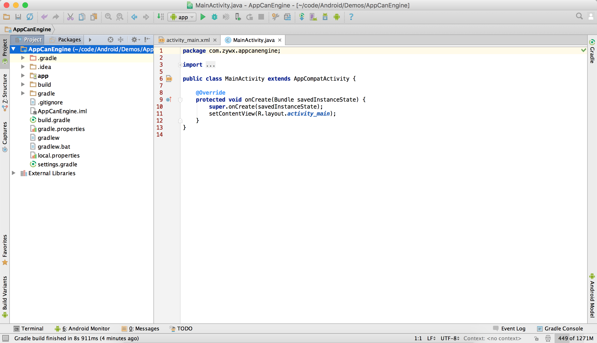
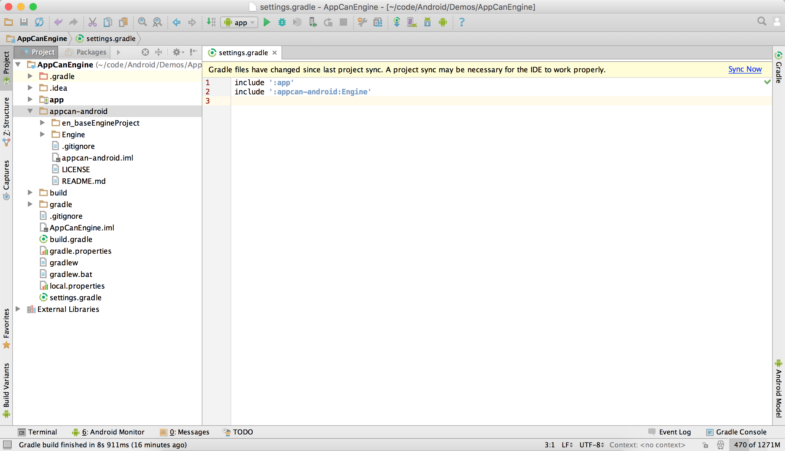
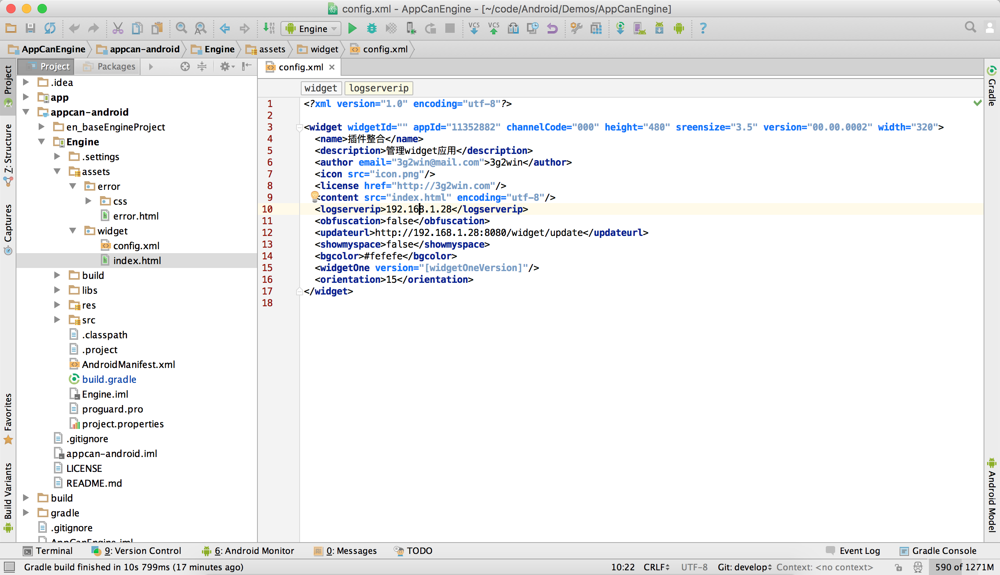
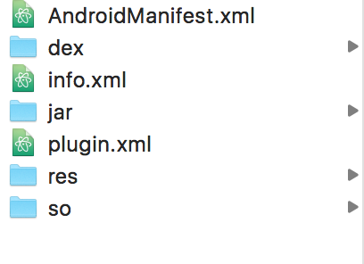
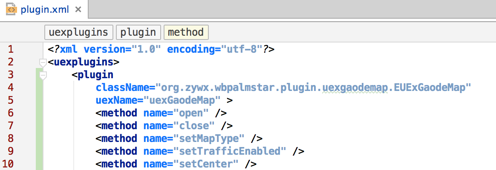
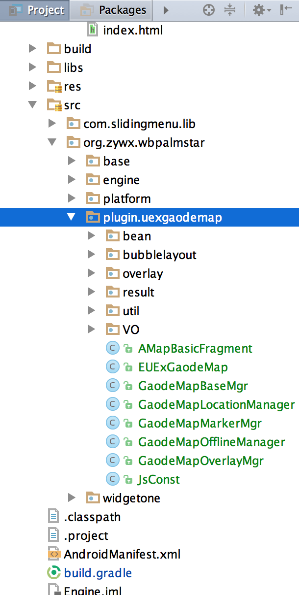
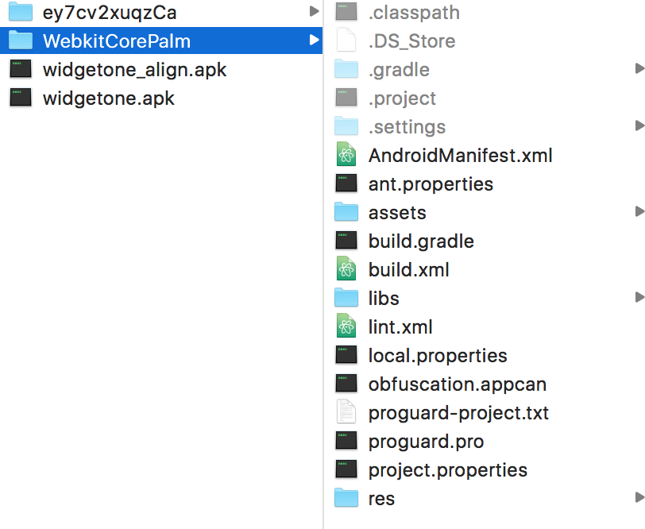

# 引擎插件调试参考文档（Android）

## 基于AppCan开发应用

*适用于不通过AppCan打包服务器打包发布，自己通过Android SDK编译打包*

### Android工程构建

#### 下载源码

把AppCan Android引擎源码（[开源地址](https://github.com/AppCanOpenSource/appcan-android)）使用git clone 代码到本地:

```sh
git clone https://github.com/AppCanOpenSource/appcan-android.git
```

或者直接[下载代码](https://codeload.github.com/AppCanOpenSource/appcan-android/zip/master)。

#### 导入工程

推荐使用Android Studio导入工程（如果对Android Studio 不熟悉可以搜索相关资料）。使用Eclispe也可以，但是使用aar相关的插件会比较麻烦。下面使用Android Studio讲解，熟悉的同学可以直接略过。

- 新建工程`AppCanEngine`。


- 将代码复制到工程根目录，并在`settings.gradle`添加配置

  ```shell
  include ':appcan-android:Engine'
  ```

  点击Sync Now

   


### 工程结构说明

 工程结构如下图所示，`en_baseEngineProject`是制作AppCan打包平台引擎包时需要的，可以忽略掉。

`assets/error`文件夹是`webview`加载网页时出错的页面，不要删掉。可以自定义相关页面，保持文件名不变即可。

`assets/widget`文件夹是HTML应用的存放路径。`widget`文件夹名字不要修改

`assets/widget/config.xml`文件配置了HTML应用的一些必要信息，不能删除：

```xml
<content src="index.html" encoding="utf-8"/> //该项配置应用的起始页，即index.html页面
```

一个最简单的`widget`目录如下图：





### HTML开发

工程建立好了之后就可以在`assets/widget`目录下面进行HTML开发了。可以让前端开发人员开发完之后，把相关文件拷如到该文件夹即可。

### 使用插件

#### 使用AppCan插件包

这里以`uexGaodeMap`高德地图插件作为示例。

下载高德地图插件包，解压后文件目录如图所示：

 

`dex`文件夹和`info.xml`文件可以忽略掉。

把`AndroidManifest.xml`内容合并到`appcan-android/Engine/AndroidManifest.xml`

把`jar`目录下的jar包拷贝到`appcan-android/Engine/libs`

把`res`目录下的资源合并到`appcan-android/Engine/res`

把`so`目录下的so文件合并到`appcan-android/Engine/libs/armeabi`

把`plugin.xml`内容合并到`xml/plugin.xml`,如图：

（新加插件时，应该拷贝`plugin`标签到`uexplugins`下面）

 

这样网页就可以调用插件了。

#### 使用AppCan插件源码

如果需要对插件进行定制化得修改。可以使用[AppCan插件源码](https://github.com/android-plugin)加入到项目中。

同样以高德地图插件为例

下载[高德地图插件源码](https://github.com/android-plugin/uexGaodeMap)

把源码中的`src`目录拷贝覆盖到`appcan-android/Engine/src`中，如下图所示

 

剩下的步骤与**使用AppCan插件包**中的步骤一致。但是插件包目录`jar`中中的`plugin_uexGaodeMap.jar`不要拷贝。因为刚才拷贝的`src`是该jar的源码。（其他插件都一样，一般jar以`plugin_uexXXX.jar`命名）

### 关于混淆

引擎中的混淆文件为`appcan-android/Engine/proguard.pro`,可以按需配置是否需要混淆。

如果引擎中新增HTML调用的接口，需要参照文件中其他接口添加keep，否则接口名被混淆后，HTML会调用不到该方法。


## 调试官方引擎插件

*适用于使用AppCan平台打包，开发过程中需要调试引擎或者某个插件时*

### 构建原生工程

#### 使用企业版打包服务

如果使用的是企业版本的打包服务器可以自己导出工程。步骤如下：

1、修改`/opt/local/sdksuit-core/core/engine/public/android/appcan.xml`中 
`deleteflag` 为`true`; 
2、重新打包 
3、`sudo -s` 切换root 用户，到/tmp/temp `ls -l`找到最新的文件夹 导出来 
4、还原`deleteflag`为`false`

#### 使用大众版打包服务

如果使用的是大众版打包服务，可以联系官方人员导出工程

拿到导出工程后,目录名为WebkitCorePalm的文件夹即为Android原生工程（以下称为调试工程）。

 

如果需要调试引擎，则把`AppCanEngine.jar`删掉，拷贝对应引擎工程的src目录到调试工程的src目录下。

如果需要调试插件，这把对应插件的jar删掉，拷贝对应插件工程的src到调试工程。

### 进行调试

调试工程弄好后，就可以进行调试了。

- 网页调试：3.3.1引擎版本可以开启远程调试：在`config.xml`中配置`<debug>true</debug>`即可。可以很方便的调试HTML内容。


- 在SD卡根目录新建一个`appcandebug.txt`可以开启调试模式。查看调用接口相关log信息，tag为`appcan`

### 常见问题

1. 远程调试网页显示空白

   Google无法访问，需要使用代理

2. 远程调试无法进入debug

   可能是某些手机管家软件占用了adb，打开任务管理器，把相关的进程关掉。

   ​