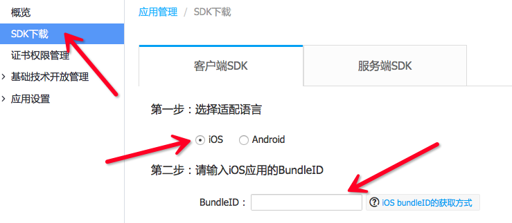
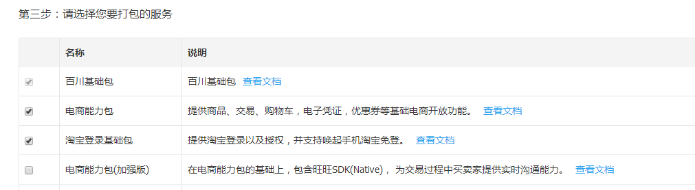
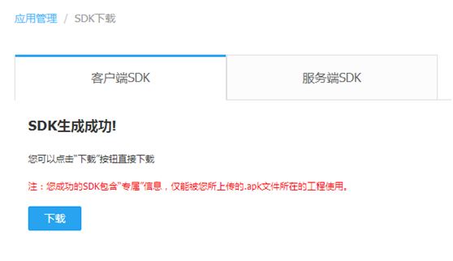
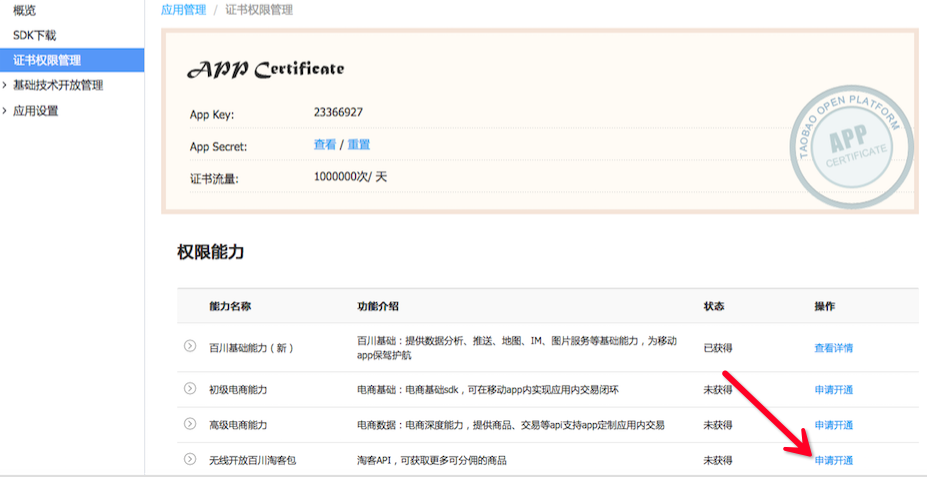
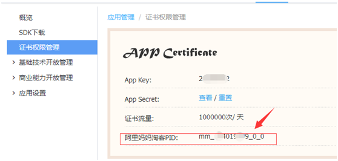
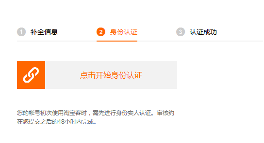
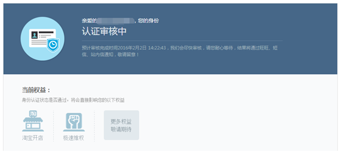
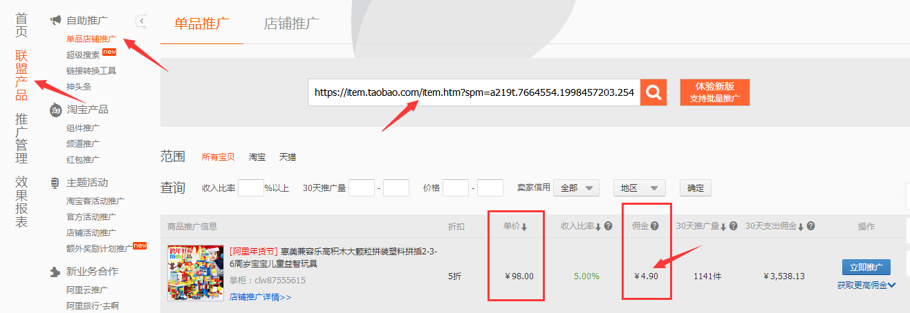
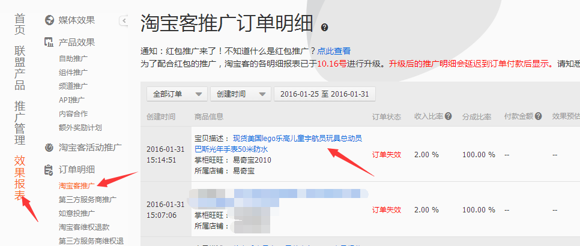
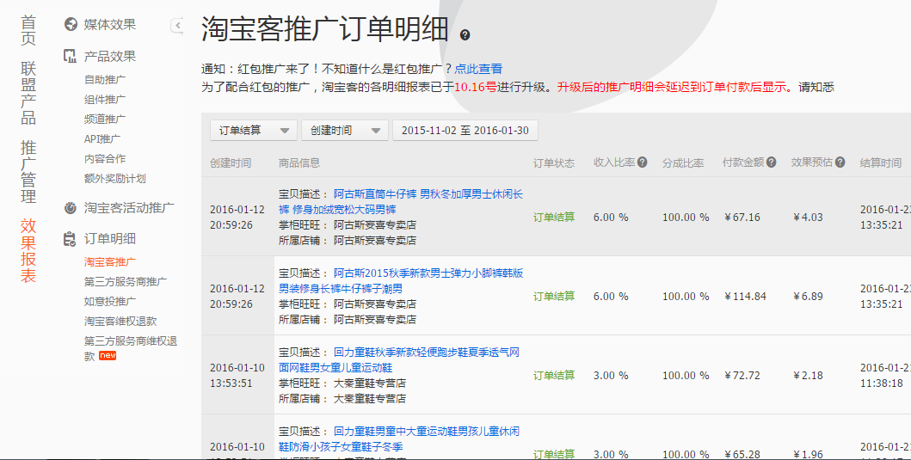

[TOC]

# 1､简介[]()
 阿里百川插件
## 1.1､说明
 封装了阿里百川sdk,百川是阿里巴巴旗下的无线开放平台,基于世界级的后端服务和成熟的商业组件,快速搭建App和提供卓越用户体验,开拓广告､商品､生活服务等无线新商业.此版本实现了阿里百川的基础功能:手淘授权登陆､退出登陆､获取登录者的信息､打开购物车､打开我的订单､通过itemid打开宝贝详情等.
 ```
  注意:该插件会与uexAliPay(支付宝插件)相冲突,不建议两者同时使用.
 ```

## 1.2､UI展示

## 1.3､开源源码
插件测试用例与源码下载:[点击](http://plugin.appcan.cn/details.html?id=623_index) 插件中心至插件详情页 (插件测试用例与插件源码已经提供)

## 1.4､平台版本支持
本插件的所有API默认支持**Android4.0+**和**iOS7.0+**操作系统.  
有特殊版本要求的API会在文档中额外说明.

## 1.5､接口有效性
本插件所有API默认在插件版本**4.0.0+**可用.  
在后续版本中新添加的接口会在文档中额外说明.
# 2､API概览
## 2.1､方法

### 🍭 init 初始化阿里百川SDK

` uexALiBaiChuan.init(cb)`

**说明:**

通过此方法初始化阿里百川SDK,这步首先要做,否则插件无反应.

**参数:**

| 参数名称 | 参数类型     | 是否必选 | 说明   |
| ---- | -------- | ---- | ---- |
| cb   | Function | 是    | 回调方法 |

**回调参数:**

```javascript
var cb = function(error, msg)
```

| 参数名称  | 参数类型   | 说明                |
| ----- | ------ | ----------------- |
| error | Number | 初始化结果, 0-成功, 1-失败 |
| msg   | String | 初始化失败时返回的错误信息     |


**示例:**

```javascript
uexALiBaiChuan.init(function(error, msg) {
	if (!error) {
		alert('init success');
	} else {
		alert('[init fail]-->' + msg);
	}
}) ;
```
### 🍭 login 登录

` uexALiBaiChuan.login(cb);`

**说明:**

通过此方法登录手机淘宝,如果没有安装手机淘宝,会使用H5打开.

**参数:**

| 参数名称 | 参数类型     | 是否必选 | 说明   |
| ---- | -------- | ---- | ---- |
| cb   | Function | 是    | 回调方法 |

**回调参数:**

```javascript
var cb = function(error, msg)
```

| 参数名称  | 参数类型   | 说明               |
| ----- | ------ | ---------------- |
| error | Number | 登录结果, 0-成功, 1-失败 |
| msg   | String | 登录失败时返回的错误信息     |


**示例:**

```javascript
uexALiBaiChuan.login(function(error, msg) {
	if (!error) {
		alert('login success');
	} else {
		alert('[login fail]-->' + msg);
	}
}) ;
```
### 🍭 logout 退出登录

` uexALiBaiChuan.logout(cb);`

**说明:**

通过此方法退出登录.

**参数:**

| 参数名称 | 参数类型     | 是否必选 | 说明   |
| ---- | -------- | ---- | ---- |
| cb   | Function | 是    | 回调方法 |

**回调参数**

```javascript
var cb = function(error, msg)
```

| 参数名称  | 参数类型   | 说明                 |
| ----- | ------ | ------------------ |
| error | Number | 退出登录结果, 0-成功, 1-失败 |
| msg   | String | 退出登录失败时返回的错误信息     |

**示例:**

```javascript
uexALiBaiChuan.logout(function(error, msg) {
	if (!error) {
		alert('logout success');
	} else {
		alert('[logout fail]-->' + msg);
	}
}) ;
```

### 🍭 getUserInfo 获取用户信息

`var info = uexALiBaiChuan.getUserInfo();`

**说明:**

通过此方法同步获取用户信息.

**参数:**

```
无
```

**返回值:**  

JSON对象(用户信息),若用户未登录返回null｡用户信息结构如下:

```json
{
    userId:,
    nick:,
    iconUrl:,
    loginTime:,
    authorizationCode:
}
```

返回结果各字段含义如下:

| 参数名称              | 参数类型   | 是否必选 | 说明   |
| ----------------- | ------ | ---- | ---- |
| userId            | String | 是    | 用户ID |
| nick              | String | 是    | 用户昵称 |
| iconUrl           | String | 是    | 头像地址 |
| loginTime         | String | 是    | 登录时间 |
| authorizationCode | String | 是    | 授权码  |

**示例:**

```javascript
 var info = uexALiBaiChuan.getUserInfo();
 if (info) {
 	alert('[info]' + JSON.stringify(info));
 } else {
 	alert('get userinfo fail');
 }              
```
### 🍭 openMyCart 打开购物车

`  uexALiBaiChuan.openMyCart(params)`

**说明:**

通过此方法打开购物车页面.

**参数:**

| 参数名称   | 参数类型   | 是否必选 | 说明           |
| ------ | ------ | ---- | ------------ |
| params | String | 否    | 接口所需数据,形式见下: |

```javascript
var params ={
    isvcode:
}
```
各字段含义如下:

| 参数名称    | 参数类型   | 是否必选 | 说明                                    |
| ------- | ------ | ---- | ------------------------------------- |
| isvcode | String | 是    | 自定义ISVCode,用于服务器订单跟踪.(如果服务器不做处理,可以不传) |

**示例:**

```javascript
var params = {
     isvcode:"appcan"
};
uexALiBaiChuan.openMyCart(JSON.stringify(params));
```
### 🍭 openMyOrdersPage 打开订单列表

` uexALiBaiChuan.openMyOrdersPage()`

**说明:**

通过此方法打开订单列表页面.

**参数:**

```
无
```

**示例:**

```javascript
uexALiBaiChuan.openMyOrdersPage();
```

### 🍭 openItemDetailPageById 打开商品真实ID对应的详情页面

`uexALiBaiChuan.openItemDetailPageById(params)`

**说明:**

通过此方法打开打开商品真实ID对应的详情.

**参数:**

| 参数名称   | 参数类型   | 是否必选 | 说明           |
| ------ | ------ | ---- | ------------ |
| params | String | 是    | 接口所需数据,形式见下: |

```javascript
var params ={
    isvcode:,
    itemid:,
    mmpid:
}
```

各字段含义如下:

| 参数名称    | 参数类型   | 是否必选 | 说明                                    |
| ------- | ------ | ---- | ------------------------------------- |
| isvcode | String | 是    | 自定义ISVCode,用于服务器订单跟踪.(如果服务器不做处理,可以不传) |
| itemid  | String | 是    | 宝贝的id                                 |
| mmpid   | String | 否    | 阿里妈妈的pid,如果不是淘客的商品,该参数可以不传            |

参数说明:

* itemid:宝贝的id,itemid为打开宝贝详情后,看到浏览器里有id一项,如"https://item.taobao.com/item.htm?id=45535180986",这里的id就是itemid.注意:商品id.支持标准的商品id,eg.37196464781;同时支持openItemId,eg.AAHd5d-HAAeGwJedwSnHktBI;必填,不允许为null;
* mmpid:阿里妈妈的pid,如果你还没有开通阿里妈妈-淘宝联盟账号,要去阿里妈妈开通账号并且补全账号信息以及绑定支付宝, 因为分销的商品最后是返回到阿里妈妈的账号,并通过支付宝提现拿到的;


**示例:**

```javascript
var params = {
     isvcode:"appcan",
     itemid : "45535180986", 
     mmpid : "mm_175878368_0_0"
};    
uexALiBaiChuan.openItemDetailPageById(JSON.stringify(params));
```
### 🍭 openItemDetailPageByURL 通过URL打开指定商品页面

`uexALiBaiChuan.openItemDetailPageByURL(params)`

**说明:**

通过URL打开指定商品页面.

**参数:**

| 参数名称   | 参数类型   | 是否必选 | 说明           |
| ------ | ------ | ---- | ------------ |
| params | String | 是    | 接口所需数据,形式见下: |

```javascript
var params ={
    url:,
    mmpid:
}
```

各字段含义如下:

| 参数名称  | 参数类型   | 是否必选 | 说明                         |
| ----- | ------ | ---- | -------------------------- |
| url   | String | 是    | 商品的url地址                   |
| mmpid | String | 否    | 阿里妈妈的pid,如果不是淘客的商品,该参数可以不传 |


**示例:**

```javascript
var params = {
	url : "https://detail.tmall.com/item.htm?id=528887107325",
	mmpid : "mm_175878368_0_0"
};
uexALiBaiChuan.openItemDetailPageByURL(JSON.stringify(params));
                  
```


#3､附录
##3.1､如何获取mmpid及插件使用说明
* 打开阿里百川官网,创建应用,进入控制台,点击SDK下载,iOS中输入bundleid,勾选电商能力包和淘宝登录基础包,生成阿里百川SDK,SDK会包含安全图片,图片名称为:yw_1222.jpg(**请勿修改**),该图片后面会使用到.生成的安全图片会包含bundleid的相关信息.若两者不匹配会导致移动端SDK初始化会失败或使用报错.
    
    
    

* 开通阿里妈妈[链接地址](http://media.alimama.com/user/limit_status.htm?spm=a219a.7395903.0.0.zr6Ni5)会员.显示以下界面则说明开通成功  
* 在阿里百川官网控制台--> 证书管理权限下,权限能力中申请开通无线开放百川淘客包,如图开通后即可显示阿里妈妈淘客PID即mmpid. 
* 加入淘宝联盟[链接地址](http://pub.alimama.com/?spm=0.0.0.0.CrMksN)
  
* 插件使用,先买个乐高试试,[链接地址](https://item.taobao.com/item.htm?spm=a219t.7664554.1998457203.254.FDU0Gt&id=38922866272)
  
  通过接口买了,

```javascript
  var params = {
            itemid : "528887107325",
            mmpid : "mm_115873368_0_0"
          };
  uexALiBaiChuan.openItemDetailPageById(JSON.stringify(params));  
```
这里教个省钱的测试方法,选中购买,到了付款界面退出,然后在去购物车找到这个订单,取消购买,
看看是否能拿到钱了,果然有了,但是是显示订单失效,当然了,你取消了嘛

给你看看成功的订单,

另外,阿里的规则(每月1号结算上一个月成功订单的返现金额,20号将钱给你,到时候你要到结算中心,把他提现转到支付宝)
##3.2､iOS插件配置说明
* 本插件需要下载插件包,将生成的sdk中的安全图片替换掉uexALiBaiChuanGroup文件下原有的安全图片作为自定义插件上传才能正常使用.
* 本插件需要config.xml配置Url Scheme,才能实现应用间的跳转,如:

```xml
  <config desc="uexALiBaiChuan" type="URLSCHEME">
      <urlScheme name="uexALiBaiChuan" schemes="['tbopen23367326']"/>
  </config>  
```
* tbopen23367326 分为两个部分: tbopen + App Key(23367326),tbopen为淘宝标识;App Key为在阿里百川控制台-->证书管理权限下的App Key,需要自己配置.

#4､更新历史 

### iOS

API版本: `uexALiBaiChuan-4.0.0`

最近更新时间:`2017-02-21`

| 历史发布版本 | 更新内容 |
| ----- | ----- |
| 4.0.0 | 新增阿里百川插件 |

### Android

API版本: `uexALiBaiChuan-4.0.0`

最近更新时间:`2017-02-21`

| 历史发布版本 | 更新内容 |
| ----- | ----- |
| 4.0.0 | 阿里百川插件 |
