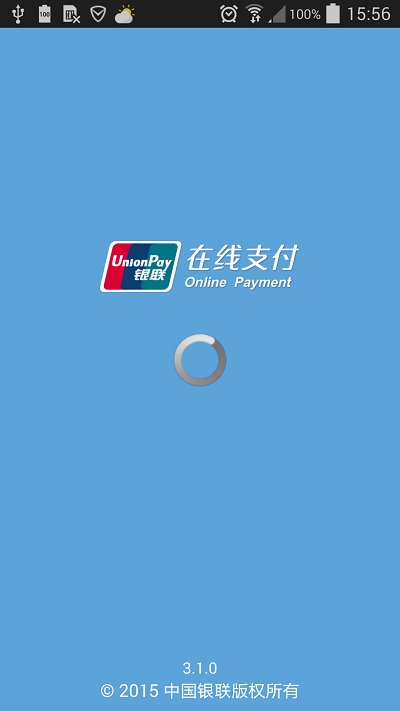
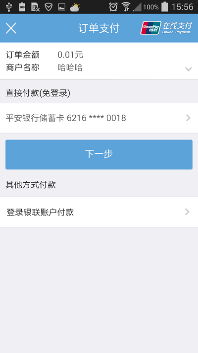
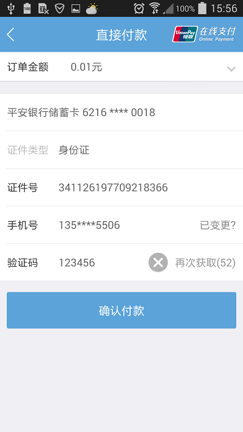
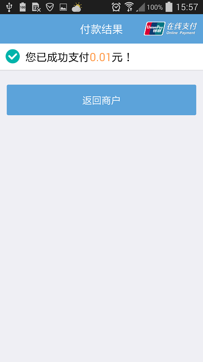

[TOC]

# 1､简介[]()
UnionPay银联支付插件

## 1.1､说明
 该插件实现UnionPay银联支付功能,使用该插件的开发者需要自己搭建商户后台,商户后台负责和银联后台交互得到交易流水号,开发者拿到交易流水号之后调用该插件的支付方法可实现支付功能.具体商户接入方式,开发者可参考[银联官方](https://open.unionpay.com/ajweb/index) .


* iOS插件自4.0.1版本后支持打开银联钱包App进行支付.为确保此功能正常,需要在config.xml中添加以下至URLScheme白名单中

  ```xml
  <string>uppaysdk</string>
  <string>uppaywallet</string>
  <string>uppayx1</string>
  <string>uppayx2</string>
  <string>uppayx3</string>
  ```

  ​


## 1.2､UI展示
    

## 1.3､开源源码
插件测试用例与源码下载:[点击](http://plugin.appcan.cn/details.html?id=536_index) 插件中心至插件详情页 (插件测试用例与插件源码已经提供)

## 1.4､平台版本支持

本插件的所有API默认支持**Android4.0+**和**iOS8.0+**操作系统. 
有特殊版本要求的API会在文档中额外说明.

## 1.5､接口有效性

本插件所有API默认在插件版本**4.0.0+**可用.  
在后续版本中新添加的接口会在文档中额外说明. 

# 2､API概览

## 2.1､方法
### 🍭 startPay 支付

`uexUnionPay.startPay(params,cb)`

**说明:**

 根据交易流水号调用支付方法.

**参数:**

| 参数名称   | 参数类型     | 是否必选 | 说明           |
| ------ | -------- | ---- | ------------ |
| params | Object   | 是    | 接口所需数据,形式见下: |
| cb     | Function | 是    | 回调方法         |

```javascript
var params = {
    orderInfo:,
    mode:
};
```

各字段含义如下:

| 参数名称      | 参数类型   | 是否必选 | 说明                                       |
| --------- | ------ | ---- | ---------------------------------------- |
| orderInfo | String | 是    | 交易流水号,是商户后台通过调用银联后台获取的                   |
| mode      | String | 是    | 测试类型,取值为"00"､"01"."00"表示银联正式环境,若开发者已经入网银联支付,可用正式环境测试;"01"表示银联测试环境,测试环境仅用于测试插件功能是否正常,测试方式请参考[插件测试说明](#5､插件测试说明) |

**回调参数:**

```
var cb = function(error){}
```
各字段含义如下:

| 参数名称  | 参数类型   | 说明                                       |
| ----- | ------ | ---------------------------------------- |
| error | Number | 支付结果,0-成功,非0-失败.结果说明,请参考[PayResult](#PayResult) |

**示例:**

```javascript
      var params = {
          orderInfo:"201512101543508484648",
          mode:"01"
      };
      uexUnionPay.startPay(params,function(error){
         if(!error){
           alert("成功");
         }else{
           alert("失败");
         }
      });
```

# 3､更新历史

### iOS

API版本: `uexUnionPay-4.0.1`

最近更新时间:`2017-02-21`

| 历史发布版本 | 更新内容 |
| ----- | ----- |
| 4.0.1 | SDK更新,支持银联钱包支付,支持ATS |
| 4.0.0 | 银联支付插件 for iOS |

### Android

API版本: `uexUnionPay-4.0.0`

最近更新时间:`2017-02-21`

| 历史发布版本 | 更新内容 |
| ----- | ----- |
| 4.0.0 | 4.0 |

# 4､附录

### PayResult
| value | 说明       |
| ----- | -------- |
| 0     | 支付成功     |
| 1     | 支付失败     |
| -1    | 支付被用户取消  |
| -2    | 支付发生未知错误 |

# 5､插件测试说明

### 银联测试环境

 **因为没有权限入网银联,于是当前官方插件只支持银联测试环境测试**

 在测试银联支付的过程中,只需要交易流水号即可.交易流水号可通过测试地址[获取测试交易流水号](http://101.231.204.84:8091/sim/getacptn).打开该网址可发现一串数字,该串数字即为测试用的交易流水号.将该交易流水号传入支付接口即可进行支付.

```javascript
    var params = {
        orderInfo:"",//获取到的交易流水号
        mode:"01"//测试环境,该参数传01
    };
    uexUnionPay.startPay(params);
```

调用之后弹出的支付界面可使用以下模拟银行卡支付:(**注该测试环境只支持以下银行卡信息支付**)

```javascript
招商银行借记卡:6226 0900 0000 0048
手机号:18100000000
密码:111101
短信验证码:123456(注需要先点击"免费获取",进入验证码过期倒计时之后再输入该验证码)
证件类型:01身份证
证件号:510265790128303
姓名:张三

华夏银行贷记卡:6226 3880 0000 0095
手机号:18100000000
CVN2:248
有效期:1219
短信验证码:123456(注需要先点击"免费获取",进入验证码过期倒计时之后再输入该验证码)
证件类型:01身份证
证件号:510265790128303
姓名:张三
```

### 银联正式环境

**需要开发者入网银联商户平台,且需要自己开发商户后台,交易流水号即是从商户后台获取的.**
调用方法如下:

```javascript
    var params = {
        orderInfo:"xxxxx",//从商户后台获取到的交易流水号
        mode:"00"//正式环境,该参数传00
    };
    uexUnionPay.startPay(params);
```

弹出的支付界面可用任意有效的银行卡支付.

