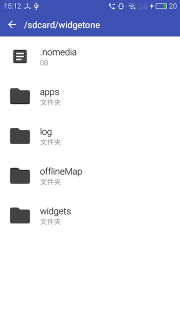
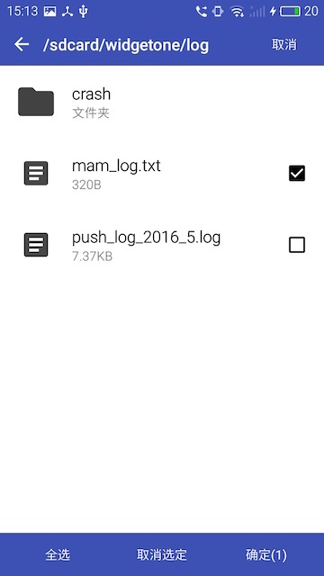

[TOC]
# 1、简介[]()
该对象主要封装了文件操作,主要包含创建文件,打开文件,以及文件提供过路径或者文件对象进行文件增,删,改,查等,读取文件内容,限utf-8编码txt文件,以及文本阅读器等多个接口。

## 1.1、说明

> 文件路径包括:`wgt://...`,`res://...`,`wgts://...`,`file://...`,`http://...`,`https://...`
> 其中: `wgt://...`对应widget的沙盒根路径,可读可写
	`res://...`对应widget目录下的wgtRes路径,只可读不可写

关于文件路径的使用,可调用uexFileMgr.getFileRealPath接口获得文件真实路径作为参考

## 1.2、UI展示



## 1.3、开源源码
插件测试用例与源码下载:[点击](http://plugin.appcan.cn/details.html?id=172_index) 插件中心至插件详情页 (插件测试用例与插件源码已经提供)

## 1.4、平台版本支持

本插件的所有API默认支持**Android4.0+**和**iOS7.0+**操作系统

有特殊版本要求的API会在文档中额外说明

## 1.5、接口有效性

本插件所有API默认在插件版本**4.0.0+**可用

在后续版本中新添加的接口会在文档中额外说明


# 2、API概览

## 2.1、方法

> ### create 创建文件

`uexFileMgr.create(param)`

**说明:**

创建文件

**参数:**

| 参数名称  | 参数类型   | 是否必选 | 说明   |
| ----- | ------ | ---- | ---- |
| param | Object | 是    | 文件设置 |


```
var param = {
    path:,//String,必选,文件路径.支持"wgt://","wgts://","wgts://"、"file://"协议
}
```

**返回值:**

uexFile对象ID
创建失败时返回null

**示例:**

```
var file = uexFileMgr.create({
	path:"wgt://data/1.txt"
});
if(!file){
	alert("创建失败!");
}
```

> ### mkdir 创建文件夹

`uexFileMgr.mkdir(param)`

**说明:**

  创建文件夹

**参数:**

| 参数名称  | 参数类型   | 是否必选 | 说明    |
| ----- | ------ | ---- | ----- |
| param | Object | 是    | 文件夹设置 |


```
var param = {
    path:,//String,必选,文件夹路径.支持"wgt://","wgts://","wgts://"、"file://"协议
}
```


**返回值:**

Boolean类型,是否创建成功

**示例:**

```
var ret = uexFileMgr.mkdir({
	path:"wgt://data/test/"
});
alert(ret);
```

> ### open 打开文件

`uexFileMgr.open(param)`


**说明:**

打开文件

**参数:**

| 参数名称  | 参数类型   | 是否必选 | 说明   |
| ----- | ------ | ---- | ---- |
| param | Object | 是    | 文件设置 |


```
var param = {
    path:,//String,必选,文件路径.支持"wgt://","wgts://"、"file://"协议
    mode:,//Number,打开设置.设置flag为: 1-可读 2-可写 4-不存在时创建新文件 ,需要多个设置同时作用时,将flag值相加再传入.比如传3(=1+2),意味着可读且可写
}
```

**返回值:**

uexFile对象ID
打开失败时返回null

**示例:**

```
var file = uexFileMgr.open({
	path: "wgt://data/1.txt",
	mode: 3
});
if(!file){
	alert("打开失败!");
}
```

> ### deleteFileByPath 根据路径删除文件

`uexFileMgr.deleteFileByPath(path)`

**说明:**

根据路径删除文件

**参数:**

| 参数名称 | 参数类型   | 是否必选 | 说明                                    |
| ---- | ------ | ---- | ------------------------------------- |
| path | String | 是    | 文件路径,路径协议详见[附录-PathTypes](#PathTypes) |

**返回值:**

Boolean类型,是否删除成功

**示例:**

```
var ret = uexFileMgr.deleteFileByPath("wgt://data/test.txt");
alert(ret);
```

> ### deleteFileByID 根据id删除文件

`uexFileMgr.deleteFileByID(id)`

**说明:**

根据id删除文件

**参数:**

| 参数名称 | 参数类型   | 是否必选 | 说明          |
| ---- | ------ | ---- | ----------- |
| id   | String | 是    | uexFile对象ID |

**返回值:**

Boolean类型,是否删除成功


**示例:**

```
var file = uexFileMgr.open({
	path: "wgt://data/1.txt",
	mode: 3
});
var ret = uexFileMgr.deleteFileByID(file);
alert(ret);
```

> ### isFileExistByPath 根据路径判断文件是否存在

`uexFileMgr.isFileExistByPath(path)`

**说明:**

根据路径判断文件是否存在

**参数:**

| 参数名称 | 参数类型   | 是否必选 | 说明                                    |
| ---- | ------ | ---- | ------------------------------------- |
| path | String | 是    | 文件路径,路径协议详见[附录-PathTypes](#PathTypes) |


**返回值:**

Boolean类型,是否存在

**示例:**

```
var ret = uexFileMgr.isFileExistByPath("wgt://data/test.txt");
alert(ret);
```

> ### isFileExistByID 根据FileID判断文件是否存在

`uexFileMgr.isFileExistByID(id)`

**说明:**

根据id判断文件是否存在

**参数:**

| 参数名称 | 参数类型   | 是否必选 | 说明          |
| ---- | ------ | ---- | ----------- |
| id   | String | 是    | uexFile对象ID |

**返回值:**

Boolean类型,是否存在

**示例:**

```
var file = uexFileMgr.open({
	path: "wgt://data/1.txt",
	mode: 3
});
var ret = uexFileMgr.isFileExistByID(file);
alert(ret);
```

> ### getFileTypeByPath 根据路径获取文件类型

`uexFileMgr.getFileTypeByPath(path)`

**说明:**

根据路径获取文件类型

**参数:**

| 参数名称 | 参数类型   | 是否必选 | 说明                                       |
| ---- | ------ | ---- | ---------------------------------------- |
| path | String | 是    | 文件路径,支持"wgt://","wgts://","res://","file://" 协议 |

**返回值:**

Number类型, -1:文件不存在或发生未知错误 0:文件 1:文件夹

**示例:**

```
var ret = uexFileMgr.getFileTypeByPath("wgt://data/test.txt");
alert(ret);
```

> ### explorer 文件管理器

`uexFileMgr.explorer(folderPath,cbFunc)`

**说明:**

文件管理器

**参数:**

| 参数名称       | 参数类型     | 是否必选 | 说明                                       |
| ---------- | -------- | ---- | ---------------------------------------- |
| folderPath | String   | 是    | 起始文件夹路径,支持"wgt://","wgts://","res://","file://" 协议 |
| cbFunc     | Function | 是    | 文件浏览结束后,会调用此函数,函数参数说明见下                  |


**回调函数的参数:**

| 参数名称 | 参数类型   | 说明                            |
| ---- | ------ | ----------------------------- |
| path | String | 用户选择的文件的路径;若用户取消选择,则path为null |


**示例:**

```
uexFileMgr.explorer("/sdcard/widgetone",function(path){
	alert(path);
});
```

> ### multiExplorer 文件管理器(多选)

`uexFileMgr.multiExplorer(path,cb)`

**说明:**

文件管理器,支持选择多个文件

**参数:**

| 参数名称 | 参数类型     | 是否必选 | 说明                                       |
| ---- | -------- | ---- | ---------------------------------------- |
| path | String   | 是    | 文件路径,支持"wgt://","wgts://","res://","file://" 协议 |
| cb   | Function | 是    | 文件浏览结束后,会调用此函数,函数参数说明见下                  |

**回调参数:**

| 参数名称  | 参数类型  | 说明                                |
| ----- | ----- | --------------------------------- |
| paths | Array | 用户选择的文件的路径构成的数组;若用户取消选择,则path为空数组 |

**示例:**

```
uexFileMgr.multiExplorer("/sdcard/widgetone",function(paths){
	alert(paths);
});
```

> ### seekFile 定位到文件某一位置

`uexFileMgr.seekFile(id,len)`

**说明:**

定位到文件某一位置

**参数:**

| 参数名称 | 参数类型   | 是否必选 | 说明          |
| ---- | ------ | ---- | ----------- |
| id   | String | 是    | uexFile对象ID |
| len  | Number | 是    | 字节数         |

**返回值:**

Boolean类型,是否定位成功

**示例:**

```
var file = uexFileMgr.open({
	path: "wgt://data/1.txt",
	mode: 3
});
var ret = uexFileMgr.seekFile(file, '1');
alert(ret);

```

> ### seekBeginOfFile 定位到起始位置

`uexFileMgr.seekBeginOfFile(id)`

**说明:**

定位到起始位置

**参数:**

| 参数名称 | 参数类型   | 是否必选 | 说明          |
| ---- | ------ | ---- | ----------- |
| id   | String | 是    | uexFile对象ID |

**返回值:**

Boolean类型,是否定位成功

**示例:**

```
var file = uexFileMgr.open({
	path: "wgt://data/1.txt",
	mode: 3
});
var ret = uexFileMgr.seekBeginOfFile(file);
alert(ret);
```

> ### seekEndOfFile 定位到结束位置

`uexFileMgr.seekEndOfFile(id)`

**说明:**

定位到结束位置

**参数:**

| 参数名称 | 参数类型   | 是否必选 | 说明          |
| ---- | ------ | ---- | ----------- |
| id   | String | 是    | uexFile对象ID |

**返回值:**

Boolean类型,是否定位成功

**示例:**

```
var file = uexFileMgr.open({
	path: "wgt://data/1.txt",
	mode: 3
});
var ret = uexFileMgr.seekEndOfFile(file);
alert(ret);
```

> ### writeFile 写文件

`uexFileMgr.writeFile(id,option ,data,cb)`

**说明:**

写文件　

**参数:**

| 参数名称   | 参数类型     | 是否必选 | 说明                    |
| ------ | -------- | ---- | --------------------- |
| id     | String   | 是    | uexFile对象ID           |
| option | Number   | 是    | 写入设置(详见下)             |
| data   | String   | 是    | 要写入的数据                |
| cb     | Function | 是    | 写入结束后,会调用此函数,函数参数说明见下 |

* uexFileWritingOption是一个枚举值,将所需设置对应的flag传入即可。
* 同时需要多种设置时,应将设置对应的flag相加后再传入。比如 option传3 (= 1+2) 意味着先进行base64解码,再追加写入.
* 不需要这些额外设置时,option请传0

| flag | 含义           | 解释                                       |
| ---- | ------------ | ---------------------------------------- |
| 1    | Append       | 包含此flag时,数据会追加写入到指定的文件                   |
| 2    | Base64Decode | 包含此flag时,插件会先对传入的字符串进行base64解码,然后将解码后的数据写入文件 |


**回调参数:**

| 参数名称 | 参数类型    | 说明     |
| ---- | ------- | ------ |
| ret  | Boolean | 写入是否成功 |


**示例:**

```
var file = uexFileMgr.open({
	path: "wgt://data/1.txt",
	mode: 3
});
uexFileMgr.writeFile(file, 0, "test",function(ret){
	alert(ret);
});
```

> ### readFile 读文件

`uexFileMgr.readFile(id,len,option,cb)`

**说明:**

读文件

**参数:**

| 参数名称   | 参数类型     | 是否必选 | 说明                    |
| ------ | -------- | ---- | --------------------- |
| id     | String   | 是    | uexFile对象ID           |
| len    | Number   | 是    | 字节数,传-1表示读取全部内容       |
| option | Number   | 是    | 读取设置(详见下)             |
| cb     | Function | 是    | 读取结束后,会调用此函数,函数参数说明见下 |

* uexFileReadingOption是一个枚举值,将所需设置对应的flag传入即可。
* 同时需要多种设置时,应将设置对应的flag相加后再传入。
* 不需要这些额外设置时,option请传0

| flag | 含义           | 解释                                    |
| ---- | ------------ | ------------------------------------- |
| 1    | Base64Encode | 包含此flag时,插件会对读取到的数据先进行base64编码,再传回给前端 |

* 不需要这些额外设置时,option请传0

**回调参数:**

```
var cb = function(error,data){}
```
| 参数名称  |  参数类型  | 说明                    |
| ----- | :----: | --------------------- |
| error |  ---   | 读取操作是否成功，(!error)表示成功 |
| data  | String | 读取到的数据,读取失败时返回null    |

**示例:**

```javascript
var file = uexFileMgr.open({
	path: "wgt://data/1.txt",
	mode: 3
});
uexFileMgr.readFile(file, -1,0,function(error,data){
	if(!error){
		alert(data);
	}else{
		alert("读取失败!");
	}
	
});
```

> ### getFileSize 获取文件大小

`uexFileMgr.getFileSize(id)`

**说明:**

获取文件大小

**参数:**

| 参数名称 | 参数类型   | 是否必选 | 说明          |
| ---- | ------ | ---- | ----------- |
| id   | String | 是    | uexFile对象ID |

**返回值:**

String类型,文件大小转成的字符串
读取失败时返回null

**示例:**

```
var file = uexFileMgr.open({
	path: "wgt://data/1.txt",
	mode: 3
});
var size = uexFileMgr.getFileSize(file);
alert(size);
```

> ### getFilePath 获取文件路径

`uexFileMgr.getFilePath(id)`

**说明:**

获取文件路径

**参数:**

| 参数名称 | 参数类型   | 是否必选 | 说明          |
| ---- | ------ | ---- | ----------- |
| id   | String | 是    | uexFile对象ID |

**返回值:**

String类型,文件路径


**示例:**

```
var file = uexFileMgr.open({
	path: "wgt://data/1.txt",
	mode: 3
});
var path = uexFileMgr.getFilePath(file);
alert(path);
```
> ### getFileRealPath 获取文件实际路径

`uexFileMgr.getFileRealPath(path)`

**说明:**

获取文件实际路径

**参数:**

| 参数名称 | 参数类型   | 是否必选 | 说明                                    |
| ---- | ------ | ---- | ------------------------------------- |
| path | String | 是    | 文件路径,路径协议详见[附录-PathTypes](#PathTypes) |

**返回值:**

String类型,文件绝对路径


**示例:**

```
uexFileMgr.getFileRealPath("wgt://data/test.txt");
```

> ### closeFile 关闭文件

`uexFileMgr.closeFile(id)`

**说明:**

关闭文件

**参数:**

| 参数名称 | 参数类型   | 是否必选 | 说明          |
| ---- | ------ | ---- | ----------- |
| id   | String | 是    | uexFile对象ID |

**返回值:**

Boolean类型,是否关闭成功

**示例:**

```
var file = uexFileMgr.open({
	path: "wgt://data/1.txt",
	mode: 3
});
var ret = uexFileMgr.closeFile(file);
alert(ret);
```
> ### getReaderOffset 获取文件偏移值

`uexFileMgr.getReaderOffset(id)`

**说明:**

获取文件偏移值

**参数:**

| 参数名称 | 参数类型   | 是否必选 | 说明          |
| ---- | ------ | ---- | ----------- |
| id   | String | 是    | uexFile对象ID |

**返回值:**

String类型,文件偏移值转成的string
发送错误时返回null
**示例:**

```javascript
var file = uexFileMgr.open({
	path: "wgt://data/1.txt",
	mode: 3
});
uexFileMgr.getReaderOffset(file);
```

> ### readPercent 读百分比对应位置的字符

`uexFileMgr.readPercent(id,percent,len,cb)`

**说明:**

读百分比对应位置的字符

**参数:**

| 参数名称    | 参数类型     | 是否必选 | 说明                    |
| ------- | -------- | ---- | --------------------- |
| id      | String   | 是    | uexFile对象ID           |
| percent | Number   | 是    | 百分比(不带百分号)            |
| len     | Number   | 是    | 字节数,读取百分比之后的字节长度      |
| cb      | Function | 是    | 读取结束后,会调用此函数,函数参数说明见下 |

**回调参数:**

```javascript
var cb = function(error,data){}
```
| 参数名称  |  参数类型  | 说明                    |
| ----- | :----: | --------------------- |
| error |  ---   | 读取操作是否成功，(!error)表示成功 |
| data  | String | 读取到的数据,读取失败时返回null    |

**示例:**

```javascript
var file = uexFileMgr.open({
	path: "wgt://data/1.txt",
	mode: 3
});
uexFileMgr.readPercent(file,20,3,function(error,data){
	if(!error){
		alert(data);
	}else{
		alert("ERROR!");
	}
});
```

> ### readNext 读取下一页字符

`uexFileMgr.readNext(id,len,cb)`

**说明:**

读取下一页字符

**参数:**

| 参数名称 | 参数类型     | 是否必选 | 说明                    |
| ---- | -------- | :--: | --------------------- |
| id   | String   |  是   | uexFile对象ID           |
| len  | Number   |  是   | 字节数                   |
| cb   | Function |  是   | 读取结束后,会调用此函数,函数参数说明见下 |

**回调参数:**

```javascript
var cb = function(error,data){}
```
| 参数名称  |  参数类型  | 说明                    |
| ----- | :----: | --------------------- |
| error |  ---   | 读取操作是否成功,(!error)表示成功 |
| data  | String | 读取到的数据,读取失败时返回null    |


**示例:**

```javascript
var file = uexFileMgr.open({
	path: "wgt://data/1.txt",
	mode: 3
});
uexFileMgr.readNext(file, 20,function(error,data){
	if(!error){
		alert(data);
	}else{
		alert("ERROR!");
	}
});
```

> ### readPre 读取上一页字符

`uexFileMgr.readPre(id,len,cb)`

**说明:**

读取上一页字符

**参数:**

| 参数名称 | 参数类型     | 是否必选 | 说明                    |
| ---- | -------- | ---- | --------------------- |
| id   | String   | 是    | uexFile对象ID           |
| len  | Number   | 是    | 字节数                   |
| cb   | Function | 是    | 读取结束后,会调用此函数,函数参数说明见下 |

**回调参数:**

```javascript
var cb = function(error,data){}
```
| 参数名称  |  参数类型  | 说明                    |
| ----- | :----: | --------------------- |
| error |  ---   | 读取操作是否成功 (!error)表示成功 |
| data  | String | 读取到的数据,读取失败时返回null    |
**示例:**

```javascript
var file = uexFileMgr.open({
	path: "wgt://data/1.txt",
	mode: 3
});
uexFileMgr.readPre(file,20,function(error,data){
	if(!error){
		alert(data);
	}else{
		alert("ERROR!");
	}
});
```

> ### openWithPassword 使用密码打开文件

`uexFileMgr.openWithPassword(param)`

**说明:**

使用密码打开文件


**参数:**

| 参数名称  | 参数类型   | 是否必选 | 说明   |
| ----- | ------ | ---- | ---- |
| param | Object | 是    | 文件设置 |


```
var param = {
    path:,//String,必选,文件路径.支持"wgt://","wgts://"、"file://"协议
    password:,//String,必须,文件密码
    mode:,//Number,打开设置,与open接口中的mode相同.
}
```

**返回值:**

uexFile对象ID
打开失败时返回null

**示例:**

```
var file = uexFileMgr.openWithPassword({
	path: "wgt://data/1.txt",
	password: "123456",
	mode: 3
});
if(!file){
	alert("打开失败!");
}
```


> ### createWithPassword 使用密码创建文件

`uexFileMgr.createWithPassword(param)`

**说明:**

使用密码创建文件

**参数:**

| 参数名称  | 参数类型   | 是否必选 | 说明   |
| ----- | ------ | ---- | ---- |
| param | Object | 是    | 文件设置 |


```
var param = {
    path:,//String,必选,文件路径.支持"wgt://","wgts://"、"file://"协议
    password:,//String,必须,文件密码
}
```

**返回值:**

uexFile对象ID
创建失败时返回null

**示例:**

```
var file = uexFileMgr.createWithPassword({
	path: "wgt://data/1.txt",
	password: "123456",
	mode: 3
});
if(!file){
	alert("打开失败!");
}
```

> ### getFileCreateTime 获取文件或文件夹的创建时间

`uexFileMgr.getFileCreateTime(id,path)`

**说明:**

获取文件或文件夹的创建时间

**参数:**

| 参数名称 | 参数类型   | 是否必选 | 说明                                       |
| ---- | ------ | ---- | ---------------------------------------- |
| path | String | 是    | 文件路径,支持"wgt://","wgts://","wgts://","res://","file://" 协议 |

**返回值:**

String类型,创建时间,`"yyyy-MM-dd HH:mm:ss"`格式
获取失败时返回null

**示例:**

```

var timeStr = uexFileMgr.getFileCreateTime('wgt://test.txt');
alert(timeStr);
```

>### renameFile 重命名文件

`uexFileMgr.renameFile(param,cb)`

**说明:**

重命名文件

**参数:**

| 参数名称  | 参数类型     | 是否必选 | 说明                     |
| ----- | -------- | ---- | ---------------------- |
| param | String   | 是    | param是字典结构json字符串,详情见下 |
| cb    | Function | 是    | 重命名结束后,会调用此函数,函数参数说明见下 |

```
var param = {
	oldFilePath:,//必选 String 重命名前的文件路径
	newFilePath:,//必选 String 重命名后的文件路径
}
```

**回调参数:**

| 参数名称      | 参数类型   | 说明      |
| --------- | ------ | ------- |
| resultObj | Object | 重命名操作结果 |

```javascript
var resultObj = {
	result:,//Number,必选.重命名成功时为1,失败时为0
}
```


**示例:**

```javascript
var data = {
	oldFilePath:"wgt://1.txt",
	newFilePath:"wgt://2.txt"
}

uexFileMgr.renameFile(JSON.stringify(data),function(obj){
	if(obj.result == 1){
		alert("重命名成功!");
	}else{
		alert("重命名失败!");
	}
});
```

> ### search 搜索文件

`uexFileMgr.search(param,cb)`

**说明:**

搜索文件


**参数:**

| 参数名称  | 参数类型     | 是否必选 | 说明                      |
| ----- | -------- | ---- | ----------------------- |
| param | String   | 是    | param是字典结构json字符串,详情见下  |
| cb    | Function | 是    | 搜索操作结束后,会调用此函数,函数参数说明见下 |

```
var param = {
	path:,//必选,String,目标文件夹路径
	option:,//可选 Number  搜索设置 见下 不传默认为0
	keywords:[]//可选 要搜索的文件名关键字 不传时搜索所有
	suffixes:[]//可选 要搜索的文件后缀名 不传时搜索所有
	}
```

| option | 说明                                     |
| ------ | -------------------------------------- |
| 1      | 匹配文件夹 也搜索符合条件的文件夹(有设置suffixes时,此项设置失效) |
| 2      | 精确匹配 只搜索文件名恰为keyword的文件                |
| 4      | 递归搜索 搜索目标文件夹及其子文件夹                     |

* 需要多项option时 请将各option值相加再传入。比如传5 (=4+1),表示既递归搜索,又匹配文件夹

**回调参数:**

| 参数名称      | 参数类型   | 说明     |
| --------- | ------ | ------ |
| resultObj | Object | 搜索操作结果 |

```
var resultObj = {
	isSuccess:,//Boolean,必选.是否搜索成功
	result:,//Array,搜索成功时才有此参数.所有符合条件的路径构成的数组;若没有路径符合搜索条件,则为一个空数组
}
```

**示例:**

```
var data={
	path:"res://",
	option:5,
	keywords:["name1","name2","name3"],
	suffixes:["txt","xml"]
	}

uexFileMgr.search(JSON.stringify(data),function(obj){
	if(obj.isSuccess){
		alert(obj.result);
	}else{
		alert("搜索失败!");
	}
});
```

> ### getFileListByPath 获取某路径下的所有文件

`uexFileMgr.getFileListByPath(path)`

**说明:**

获取某路径下的所有文件


**参数:**

| 参数名称 | 参数类型   | 是否必选 | 说明                                   |
| ---- | ------ | ---- | ------------------------------------ |
| path | String | 是    | 文件夹路径,支持wgt://, wgts://, file://协议路径 |


**返回值:**

* path无效或者不是文件夹 返回null
* 空文件夹 返回空数组
* 正常情况  返回路径信息构成的数组Array<FileInfo>

路径信息<FileInfo>结构定义如下

```
var FileInfo = {
	fileName:,//String,文件名
	filePath:,//String,文件路径
	fileType:,//Number,类型。0-文件 1-文件夹 
}
```

**示例:**

```
var path = "wgt://"
var result = uexFileMgr.getFileListByPath(path);
alert(result);
```

> ### getFileSizeByPath 通过路径获取文件大小

`uexFileMgr.getFileSizeByPath(params,cb)`

**说明:**

通过路径获取文件或文件夹大小

**参数:**

| 参数名称  | 参数类型     | 是否必选 | 说明                     |
| ----- | -------- | ---- | ---------------------- |
| param | String   | 是    | param是字典结构json字符串,详情见下 |
| cb    | Function | 是    | 操作结束后,会调用此函数,函数参数说明见下  |


```
var params = {
    id:,
    path:,
    unit:
}
```
各字段含义如下:

| 字段名称 | 类型     | 是否必选 | 说明                                       |
| ---- | ------ | ---- | ---------------------------------------- |
| path | String | 是    | 文件或文件夹路径,支持wgt://, wgts://, file://协议路径 ,路径协议详见[附录-PathTypes](#PathTypes) |
| unit | String | 否    | 文件大小单位,默认为"B",取值范围参考[unit](#GetFileSizeUnit) |

**回调参数:**

| 参数名称      | 参数类型   | 说明     |
| --------- | ------ | ------ |
| resultObj | Object | 搜索操作结果 |

```
var resultObj = {
	errorCode:,//Number, 0-获取成功 1-获取失败
	unit,//String,文件大小单位
	data,//Number,文件大小
}

```


**示例:**

```
var params = {
 	path:"wgt://",
 	unit:"KB"
}
var data = JSON.stringify(params);
uexFileMgr.getFileSizeByPath(data,function(info){
	if(info.errorCode == 0){
		alert(info.data);
	}else{
		alert("ERROR!");
	}
});
```

> ### copy 复制 

`uexFileMgr.copy(param,cbFunc);`

**说明:**

复制文件或文件夹


**参数:**

| 参数名称   | 参数类型     | 是否必选 | 说明           |
| ------ | -------- | ---- | ------------ |
| param  | Object   | 是    | 复制操作的参数,详见下  |
| cbFunc | Function | 是    | 操作结束后,会调用此函数 |

```javascript
var param = {
    src:,//源文件或文件夹路径
    target:,//目标文件夹路径
}

var cbFunc = function(error){
    //error,为复制操作的结果,(!error 表示复制成功)
}
```

* copy会将源文件或者文件夹，复制至目标文件夹内,**不会进行重命名操作**

**示例:**

```javascript
uexFileMgr.copy({
	src: "wgt://test/1.txt",
	target: "wgt://test2/" 
},function(error){
	if(!error){
		alert("复制成功");
	}else{
		alert("复制失败");
	}
});
```


# 3、更新历史

### iOS

API版本:`uexFileMgr-4.0.0`

最近更新时间:`2016-7-29`

| 历史发布版本 | 更新内容     |
| ------ | -------- |
| 4.0.0  | 文件管理功能插件 |

### Android

API版本:`uexFileMgr-4.0.0`

最近更新时间:`2016-7-29`

| 历史发布版本 | 更新内容     |
| ------ | -------- |
| 4.0.0  | 文件管理功能插件 |


# 4、附录

### GetFileSizeErrorCode

| errorCode | 说明            |
| --------- | ------------- |
| 0         | 获取成功          |
| -1        | 无参数错误         |
| -2        | 当前路径文件或文件夹不存在 |
| -3        | 未知错误          |

### GetFileSizeUnit

| value | 说明           |
| ----- | ------------ |
| B     | 字节           |
| KB    | 1KB = 1024B  |
| MB    | 1MB = 1024KB |
| GB    | 1GB = 1024MB |

### PathTypes

| 协议头             | Android对应路径 (其中"/sdcard/"等 同于"/storage/emulated/0/") | iOS对应路径                           |
| --------------- | ---------------------------------------- | --------------------------------- |
| res://          | widget/wgtRes/                           | widget/wgtRes                     |
| wgt://          | /storage/emulated/0/widgetone/apps/ xxx(widgetAppId)/ | /Documents/apps/xxx(widgetAppId)/ |
| wgts://         | /storage/emulated/0/widgetone/widgets/   | /Documents/widgets/               |
| file:///sdcard/ | /storage/emulated/0/                     | 绝对路径                              |

